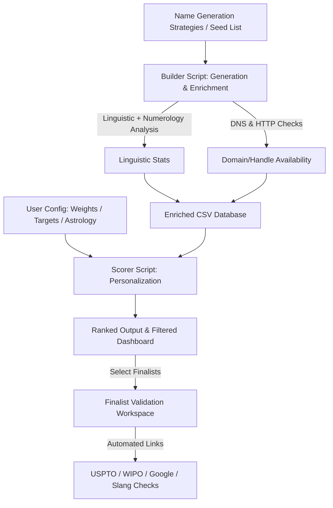

# Product Requirements Document (PRD): Brando

**Project Name:** Brando  
**Status:** Draft / Active Requirements Stage  
**Author:** Antigravity & Sunil  

---

## 1. Project Overview & Objectives
**Brando** is an open-source, highly customizable pipeline to discover, validate, score, and filter high-quality brand names for businesses, startups, ventures, or holding companies. 

Instead of relying on generic generators or manual brainstorming, Brando provides a structured, developer-friendly approach to naming. It is designed to be **generalizable** so that anyone can use it to solve their own naming challenges by generating a seed database and filtering it based on their own personal naming framework.

### Core Goals:
1.  **Automated Candidate Generation:** Generate names using smart linguistic rules, prefixes, suffixes, and patterns (e.g., neoclassical, portmanteaus, abstract, or metaphorical real words).
2.  **Rich Metadata & Verification:** Automatically enrich candidates with linguistic properties (syllables, prefix), visual/typographic metrics, esoteric calculations (Chaldean & Pythagorean numerology), and availability status (domains & social handles).
3.  **Personalized Filtering & Scoring:** Allow users to define their own naming framework (weights, target numerology numbers, astrology sound matches, handle rules) in a local configuration file to score and filter candidates.
4.  **Finalist Validation Workspace:** Streamline the final selection process by providing tools to compare finalists side-by-side and launch manual verification checks (trademarks, global search clashes).
5.  **Programmatic Python Utility Library:** Structure the codebase so it is not just a CLI tool, but can also be imported as a Python package (`import brando`). This allows developers to programmatically generate names, verify domain/handle availability, and compute numerology/esoteric values directly inside their own Python projects.

---

## 2. Naming Philosophy & Criteria
To create or select high-quality, scalable brand names, candidates are evaluated across two phases: **Database Generation** and **User Filtering/Scoring**.

### A. Core Generation Strategies
The generator script should support seeding or building names via:
*   **Neoclassical/Latinate:** Blending Latin/Greek roots (e.g., *Altria*, *Novartis*, *Aera*).
*   **Portmanteau/Blends:** Combining two words or word parts (e.g., *Microsoft*, *FedEx*, *AeroVance*).
*   **Abstract/Invented:** Phonetically clean, invented words (e.g., *Kodak*, *Sony*, *Vanta*).
*   **Real Word Metaphors:** Common words used out of context, focusing on power and simplicity (e.g., *Apple*, *Slack*, *Apex*, *Forge*).

### B. Typographic & Visual Balance (Logo Potential)
To estimate a name's visual strength for a modern logo, the tool will analyze:
*   **Letter Count Harmony:** Ideal length is 4–7 characters.
*   **Vertical Balance (Ascenders vs. Descenders):** 
    *   *Ascenders:* `t, d, f, h, k, l, b`
    *   *Descenders:* `g, j, p, q, y`
    *   *Midline:* `a, c, e, o, m, n, r, s, u, v, w, x, z`
    *   Names containing entirely midline letters (e.g., *Amazon*, *Vanta*, *Nexus*) or having perfectly symmetrical ascender/descender counts look visually cleaner in wordmark logos.
*   **Symmetry / Palindromic Properties:** Checking for repeating letters or symmetrical mirror-like structures (e.g., *Vev*, *Level*, *Otto*).

### C. Validation & Technical Availability Checks
*   **Domain Checks:** 
    *   Primary check for `.com` domain availability.
    *   Fallback checks for premium alternative TLDs: `.co`, `.io`, `.ai`, `.net`.
*   **Social Handle Checks:** Automated availability checks for handles on key platforms:
    *   Twitter / X
    *   Instagram
    *   GitHub
    *   LinkedIn

### D. Esoteric & Legacy Constraints
*   **Vedic Astrology Compatibility:** Flag starting sounds (rashi/nakshatra phonetics) matching the user's preference.
*   **Numerology Scores:**
    *   *Chaldean Numerology:* Name vibration calculations.
    *   *Pythagorean Numerology:* Structural name analysis.
*   **Family Legacy Potential:** Integration of specific heritage initials or roots.

---

## 3. Personalized Scoring Framework
Each candidate brand name in the database will be evaluated using a customizable, weighted scoring model defined in a user configuration file (e.g., `config.json` or `config.yaml`).

### Default Scoring Weights:

| Evaluation Factor | Default Weight (1-5) | Description / Criteria |
| :--- | :--- | :--- |
| **Global Brand Potential** | ⭐⭐⭐⭐⭐ (5) | Does it sound like a global player? (e.g., Rolex, Sony, Apple) |
| **Premium Feel** | ⭐⭐⭐⭐⭐ (5) | Auditory and visual elegance. |
| **Memorability** | ⭐⭐⭐⭐⭐ (5) | Retention factor after a single exposure. |
| **Scalability** | ⭐⭐⭐⭐⭐ (5) | Multi-industry viability (AI, Finance, Manufacturing, Consumer). |
| **Pronunciation** | ⭐⭐⭐⭐ (4) | Phonetic ease across global languages. |
| **Family Legacy** | ⭐⭐⭐⭐ (4) | Potential to sound established and generational. |
| **Astrology Compatibility** | ⭐⭐⭐ (3) | General Vedic astrology compatibility with user's preferred sounds. |
| **Numerology Score** | ⭐⭐⭐ (3) | Chaldean and Pythagorean numerical compound score alignment. |

---

## 4. System Architecture & Workflow

### Phase 1: Generation & Validation (The "Builder" Script)
*   **Input:** Linguistic patterns, prefix/suffix configs, or a list of raw seeds.
*   **Process (Incremental & Dynamic):**
    *   **Config Diffing:** Instead of generating the entire database from scratch, the builder compares current config options against existing names in `brand_candidates.csv`. It only runs calculations and tests for *newly added* candidate names unless a full rebuild flag (e.g., `--rebuild`) is set.
    *   **Domain & Handle Re-checking:** Because domain and social handle registration status changes over time, the script supports a refresh mode (e.g., `--refresh-availability`). This parses existing candidates and queries DNS and HTTP endpoints again to retrieve the latest, up-to-the-minute availability status.
    *   **Static Calculations:** Offline stats (numerology, syllable count, visual balance) are calculated once and cached for each name.
    *   **Validation Check execution:** Perform DNS queries to check if domains are registered and HTTP status checks for handle availability.
*   **Output:** `brand_candidates.csv` containing all raw metrics and availability statuses.

### Phase 2: Personalization & Scoring (The "Filter" Script)
*   **Input:** `brand_candidates.csv` and `config.json` (user-specific preferences).
*   **Process:**
    *   Read user configuration.
    *   Flag names that match the user's Vedic astrology starting sounds.
    *   Score numerology matches (e.g., destiny/compound number matches).
    *   Compute the final weighted score for each candidate.
    *   Filter out candidates where `.com` is taken or social handles are unavailable.
*   **Output:** A clean, ranked list of brand name recommendations.

### Phase 3: Finalist Validation Workspace
*   For the top 5–10 finalists, the tool generates a summary report including:
    *   **Direct Trademark Search Links:** e.g., pre-built URL queries for USPTO and WIPO trademark databases.
    *   **Search Engine Clash Check Links:** Pre-built Google search URLs to inspect existing businesses with similar names.
    *   **Cultural / Slang Check Links:** Search links to check for alternative dictionary or slang meanings.

---

## 5. Feasibility, Open-Source & Monetization Architecture

### A. Feasibility & Cost Control (100% Free & Local Stack)
To ensure the CLI pipeline is accessible and free to run:
*   **Linguistic & Esoteric calculations:** Done completely offline using local string math and standard phonetic libraries. No API keys needed.
*   **Domain Checks:** Done via standard local DNS lookups (`socket.getaddrinfo` or `dnspython`). This does not require paying for domain availability APIs or registration databases.
*   **Social Handle Checks:** Handled via asynchronous HTTP calls (e.g. status code checking). No expensive API rates or developer accounts needed for basic availability check.

### B. Dynamic Architecture (Not One-Size-Fits-All)
Every component is configuration-driven. The user provides a JSON/YAML file specifying:
*   Prefixes/roots to generate names.
*   Target syllable length and visual parameters.
*   Custom weights for scoring.
*   Horoscope starting phonetics.
*   Specific target numbers in numerology.

### C. Future Monetization & Community Scope
Should the project gain open-source traction, the architecture naturally supports these monetization and donation channels:
1.  **SaaS Web Wrapper (Premium Tier):**
    *   Build a sleek visual web application wrapping the core CLI engine.
    *   *Monetization:* Users pay for bulk generation, fast cloud check processing, premium TLD validation (WHOIS lookup for purchase price/broker status), or AI-powered naming suggestions.
2.  **Premium Seed Packages:**
    *   Selling specialized dictionaries (e.g., "10,000 Neoclassical Roots for Tech Startups" or "Generational Holding Company Roots").
3.  **Community Donations / Funding:**
    *   Github Sponsors and OpenCollective support.
    *   Developer-centric branding: position Brando as the "PostgreSQL of naming frameworks" (flexible, robust, community-owned).

---

## 6. Project Roadmap & Implementation Tasks
1.  **Linguistic & Esoteric Libs:** Write modular functions to calculate syllable counts, visual balance, Pythagorean values, and Chaldean values.
2.  **Checking Engine:** Implement fast DNS resolution for domains and HTTP status checkers for handles.
3.  **Generator CLI:** Build the script that generates candidates, runs checks, and saves them to the CSV.
4.  **Config-Driven Scorer:** Build the secondary script that loads the CSV, applies the user's weights/astrology/numerology filters, and ranks the candidates.
5.  **Finalist Workspace Utility:** Implement a quick report generator that compiles details and pre-formatted validation URLs for shortlisted finalists.
6.  **GitHub Repo Ready:** Add a clean `README.md`, setup a CLI entry point, and document how other users can plug in their own rules.

