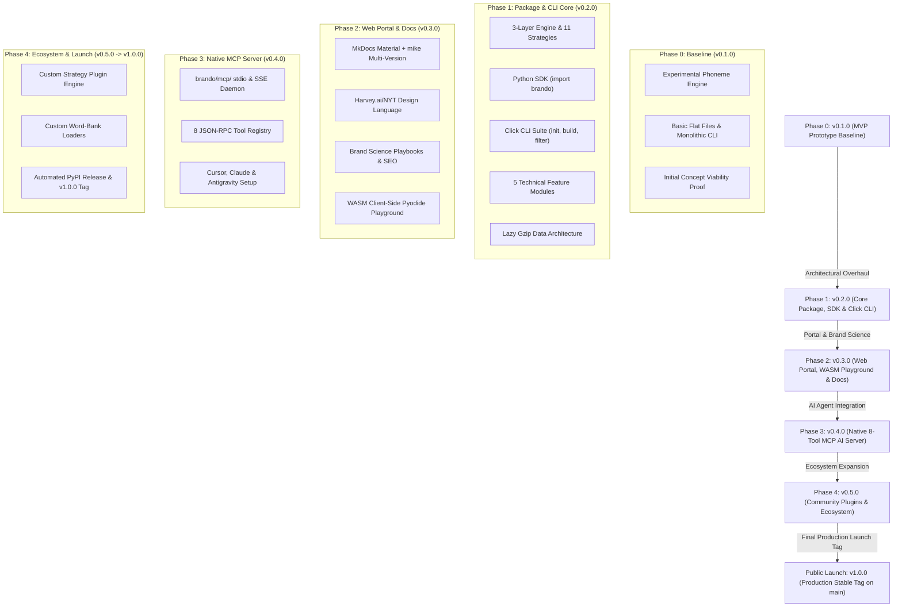

# **Enterprise Naming Intelligence Platform (Brando) - Project Requirements Document (v2.0)**

## **1. Executive Summary & Core Architectural Principles**

**Brando** is a data-driven naming intelligence engine that translates qualitative branding research into quantitative, filterable, and programmatically verifiable metrics. The platform evaluates proposed brand names across typographical visual structures, phonetic sound symbolism, cultural alignments, trademark registrations, digital domain spaces, and developer registry namespace constraints.

### **Product Objectives**
*   **Linguistic Scoring**: Replace subjective branding guesses with algorithmic metrics for readability, cadence, sound symbolism, and emotional resonance.
*   **Namespace Security & Verification**: Prevent security threats such as typosquatting and dependency confusion in open-source packages while confirming domain and social media handle availability.
*   **Legal & Regulatory Vetting**: Automate international Nice trademark classification checks, WIPO Madrid Protocol audits, and regional slang checks.
*   **AI-Agentic Orchestration**: Expose these tools via the Model Context Protocol (MCP) to integrate into developer environments, IDEs, and generative design agents.

### **Core Architectural Principles & Design Philosophy**

1.  **Maximally Permissive Generation**: Quality signals (pronounceability, sound symbolism, industry affinity, legal risks) migrate 100% to the **filter/analysis layer** as queryable database columns. The generator never deletes or suppresses candidate names on behalf of the user. Brand judgment belongs to the user, backed by data.
2.  **Zero-Config Unbiased Defaults**: Out-of-the-box generation is unbiased (`generation_alignment: []`, `phoneme_patterns: null`). User populates alignment targets only when specific founder, cultural, or industry biases exist.
3.  **100% Free & Local Security Engine**: Uses C++ SIMD `RapidFuzz` and `BK-Tree` metric indexing over bundled open-source brand datasets (`top_1000_*.txt`) to deliver sub-35ms phishing risk checks locally with $0.00 API cost.
4.  **Single Source of Truth Config**: All execution bounds, preset mappings, and filter parameters flow from a unified `config.yaml` schema contract.

---

## **2. Architectural Progression & Codebase Roadmap**

The product follows a clear **5-Phase Pre-Release Progression** transitioning from baseline experimentation to public production launch:



### **Progression Milestones**:

#### **2A. Phase 0: MVP Prototype Core Baseline (`v0.1.0`)**
*   **Proof-of-Concept Baseline**: The initial prototype documented in legacy `docs/PRD.md`.
*   **Experimental Synthesis**: Tested basic phoneme combinations, initial sound symbolism scoring, and flat CSV file outputs (`brand_candidates.csv`).
*   **Validation Goal**: Validated core product viability and demonstrated market demand for computational naming logic.

#### **2B. Phase 1: Core Package, SDK & CLI Stabilization (`v0.2.0` Milestone)**
*   **Master PRD v2 Realignment**: The primary architectural focus of `prdv2.md`.
*   **Python SDK Library (`import brando`)**: Object-oriented API exposing `brando.Config`, `brando.Pipeline`, `brando.Database`, and Section 6 feature modules (`brando.modules.*`).
*   **Click CLI Command Suite**: Production terminal commands (`brando init`, `brando build`, `brando filter`, `brando verify`, `brando check-socials`, `brando export`, `brando prune`).
*   **3-Layer Engine & 11 Strategies**: Combines Layer 1 phoneme core synthesis with Layer 2 vocabulary enrichment and Layer 2a orthographic post-passes.
*   **5 Technical Feature Modules & Lazy Data**: Implements visual Bouma silhouettes (6A), sound symbolism (6B), esoteric numerology/Nakshatras (6C), Nice Class mapping (6D), and sub-35ms RapidFuzz SIMD security checks (6E) backed by lazy gzipped vocabulary assets (`.json.gz`).

#### **2C. Phase 2: Web Portal, Brand Science Playbooks & WASM Playground (`v0.3.0` Milestone)**
*   **Official Web Portal Deployment**: Publishes documentation site on GitHub Pages using MkDocs Material + `mike` multi-version engine.
*   **Harvey.ai / OpenAI / NYT Design System**: High-contrast Editorial Serif headers + obsidian dark glassmorphic UI.
*   **Brand Science Playbooks**: High-ranking SEO playbooks for Sound Symbolism, Bouma Silhouettes, 108 Nakshatra Padas, and Typosquatting protection.
*   **WASM Client-Side Playground**: Pyodide web demo allowing users to build `config.yaml` live in the browser without installing Python locally.

#### **2D. Phase 3: Native MCP AI Agent Integration (`v0.4.0` Milestone)**
*   **Native MCP Server (`brando/mcp/`)**: Implements Model Context Protocol (MCP) exposing an 8-tool JSON-RPC registry (3 High-Level Workflows + 5 Atomic Engine Tools) for AI LLM Agents (Cursor, Claude Desktop, Gemini Antigravity Agent).
*   **Agent Setup Templates**: Includes 1-click configuration blocks for Cursor `.cursor/mcp.json` and Claude Desktop `claude_desktop_config.json`.

#### **2E. Phase 4: Community Strategy Plugins & Public Launch (`v0.5.0` $\rightarrow$ `v1.0.0` Stable Tag)**
*   **Custom Strategy Plugin Engine**: Extends `enrichment.custom_rules`, `custom_substitution_map`, and `custom_word_bank_path` to support user-authored naming plugins.
*   **Automated Release & Sponsorships**: Automated PyPI wheel publishing via OIDC and GitHub Sponsors wall (`SPONSORS.md`).
*   **Final Stable Launch Tag**: Official `v1.0.0` stable production tag published on `main` once all 4 development phases pass 100% test suite and performance benchmarks!

> [!NOTE]
> **Commercial SaaS Scope Isolation**: Any future commercial cloud hosting platform, multi-tenant SaaS service, or managed REST API operates under a **separate private repository scope**. This open-source repository remains 100% dedicated to open-source package, SDK, CLI, and MCP community excellence.

---

## **3. Master Configuration Schema Specification (`config.yaml`)**

The `config.yaml` file is the **upstream single source of truth** for all platform settings. Every execution parameter flows directly from this specification.

```yaml
# ═══════════════════════════════════════════════════════════════
# SECTION A: Naming Context, Registry & Industry  [COMMAND: brando build]
# ═══════════════════════════════════════════════════════════════
# STEP 1: Set naming_context — high-level intent / use case:
#   company     → brand name for a company or startup (no registry)
#   product     → consumer product or SaaS product name (no registry)
#   startup     → invented feel, domain-safe, strong initials (no registry)
#   software    → general software ecosystem name (pair with registry)
#   package     → package manager name (pair with registry)
#   module      → importable module / library (pair with registry)
#   repo        → source code repository name (pair with registry)
#   custom      → define raw constraints manually (no preset)
naming_context: company

# STEP 2: Set registry — specific ecosystem whose formatting rules apply.
# Only required when naming_context is: software | package | module | repo
registry: null   # e.g. npm | pypi | go | crates | nuget | maven | docker | ...

# STEP 3: Set industry_context — target commercial sector or hybrid list.
# null = Unbiased General Default (no industry assumption)
# Automatically maps default Nice Class codes, TLD clusters, and social channels when set:
#   tech         → Class 9 (Apps), 35 (Biz), 42 (SaaS) | TLDs: .ai, .io, .dev, .com
#   fashion      → Class 25 (Apparel), 35 (Retail) | TLDs: .shop, .store, .co, .com
#   food         → Class 29 (Dairy/Meats), 30 (Coffee/Snacks), 32 (Drinks), 35 (Store)
#   pharma       → Class 5 (Pharma/Supplements), 10 (Medical Devices), 44 (Health)
#   fintech      → Class 9 (Banking App), 36 (Financial), 42 (Fintech SaaS)
#   cosmetics    → Class 3 (Skincare/Perfumes/Cosmetics), 35 (Beauty Retail)
#   entertainment→ Class 9 (Gaming Apps), 41 (Media/Entertainment Services)
#   real_estate  → Class 36 (Real Estate Affairs), 37 (Construction/Development)
#   custom       → Define explicit nice_classes list manually in validation block
industry_context: null   # null = unbiased default | e.g. tech | fashion | food | fintech


# ═══════════════════════════════════════════════════════════════
# SECTION B: Core Generator — Phoneme Synthesis  [COMMAND: brando build]
# ═══════════════════════════════════════════════════════════════
generation:
  # Phoneme structural templates (core engine patterns)
  # null = Dynamic Generation Mode (synthesizes ALL valid 0-CC combinations up to max_segment_letters)
  # [CVC, CVCV, CVVC, CVCVC] = Explicit Custom Pattern List
  phoneme_patterns: null

  # Automatic 'q' -> 'qu' bigram transformation
  # true (default) = generates 'quavo', 'quera' (English convention)
  # false = allows raw 'q' floating in C slots ('qavo', 'qvla', 'qraft' for Gen-Z/gaming brands)
  auto_qu_bigram: true

  # Default consonant pool: ALL 21 consonants — generation is maximally permissive.
  phoneme_consonants: [b, c, d, f, g, h, j, k, l, m, n, p, q, r, s, t, v, w, x, y, z]

  # Default vowel pool: all 5 base vowels
  phoneme_vowels: [a, e, i, o, u]

  # Starting letter preferences (biases first character during generation)
  preferred_initials: []   # e.g. [A, V, X] — empty = use all letters equally

  # Multi-Segment Chaining (controls compound & long names)
  max_segments: 1             # 1 = single word, 2 = two-block, 3 = three-block
  max_segment_letters: 7      # max chars per individual phoneme block
  segment_separator: null     # null=fused (BookMyShow), "-"=hyphen, "_"=snake, "."=dot


# ═══════════════════════════════════════════════════════════════
# SECTION C: Raw Constraints Override  [COMMAND: brando build]
# ═══════════════════════════════════════════════════════════════
constraints:
  min_letters: null        # e.g. 4 (null = use naming_context default)
  max_letters: null        # e.g. 7 (null = use naming_context default)
  max_syllables: null      # e.g. 2 (null = use naming_context default)
  max_candidates: 10000    # total pool size cap
  allowed_chars: null      # e.g. "^[a-zA-Z]+$"
  disallowed_chars: []
  allow_numbers: null
  allow_hyphens: null
  allow_underscores: null
  min_vowels: null
  max_vowels: null
  min_consonants: null
  max_consonants: null


# ═══════════════════════════════════════════════════════════════
# SECTION D: Vocabulary Enrichment Strategies  [COMMAND: brando build]
# ═══════════════════════════════════════════════════════════════
# Layer 2 enrichment strategies add semantic flavor & word blends to the pool.
# DATA ARCHITECTURE: Brando bundles 100K+ roots & vocabulary datasets in
# brando/data/vocabularies/. If auto_industry_roots: true, Brando automatically
# loads industry-specific root banks. Users can append or override via custom fields.
enrichment:
  # Auto-load industry root dictionaries & strategy defaults based on industry_context
  auto_industry_roots: true    # true (default) | false (use manual lists below)

  # Enabled strategies list.
  # Available Layer 2 Enrichment Strategies:
  #   - neoclassical      → Latin/Greek root morphemes (Novartis, Altria, Sonos)
  #   - portmanteau       → Word blends with letter merge (Microsoft, Pinterest, FedEx)
  #   - analogous_suffix  → Brand suffix blending (Shopify, Spotify, Bitly, Solana)
  #   - metaphorical      → Real words out of context (Apple, Slack, Amazon)
  #   - compound          → Concatenated full words (Facebook, ThinkPad, WordPress)
  #   - truncation        → Clipped root seeds (Intel, FedEx, Dunkin')
  #   - acronym           → Phrase initialisms (IBM, GEICO, NASA)
  #   - suggestive        → Thesaurus concept proximity (Swiffer, Fitbit, Uber)
  strategies: []              # empty = auto-selected via industry_context (or set explicit list)

  # Enabled Layer 2a Post-Pass Orthographic Modifications:
  post_passes: []             # e.g. [phonetic_spell, letter_sub, alphanumeric] — empty = none

  # Detailed Post-Pass Transformation Settings & Custom Extension Surface
  post_pass_settings:
    phonetic_spell:
      drop_final_vowel: true   # Flickr (Flicker -> Flickr), Tumblr (Tumbler -> Tumblr)
      i_to_y: true             # Lyft (Lift -> Lyft), Vybe (Vibe -> Vybe)
      c_to_k: true             # Krispy (Crispy -> Krispy), Kwik (Quick -> Kwik)
      f_to_ph: false           # Phast (Fast -> Phast)
      z_for_s: false           # Boyz (Boys -> Boyz)
      custom_rules: []         # User custom regex/phonetic pairs, e.g. [{pattern: "tion$", replace: "shun"}]

    letter_sub:
      substitution_map:
        i: y                   # Zymbol (Symbol -> Zymbol)
        o: oo                  # Froot (Fruit -> Froot)
        s: z                   # Zappos (Zapatos -> Zappos)
        x: ks                  # Pixar (Picsar -> Pixar)
      custom_substitution_map: {} # User custom letter swap dictionary, e.g. { a: "8", e: "3" }

    alphanumeric:
      placement: suffix        # suffix | prefix | infix
      separator: "-"           # "-", "_", or null
      allowed_numerals: [21, 42, 360, 247, 7] # e.g. Nexus-21, Xbox-360, WD-40
      custom_numerals: []      # User custom serial numbers, e.g. [99, 500, 3000]
      auto_year: false         # true = appends current year (e.g. Brando-2026)

  # Custom Vocabulary Override & Extension Surface (Appends to or overrides bundled data)
  custom_prefixes: []          # e.g. [nova, apex, sys, flux, kinet]
  custom_suffixes: []          # e.g. [tech, link, sys, flux, vance]
  brand_suffixes: [ify, ly, io, ex, is, a]  # built-in modern brand suffixes
  custom_brand_suffixes: []   # user custom brand suffixes, e.g. [base, lab, box]
  word_bank_themes: []         # e.g. [tech, speed, nature, security]
  custom_word_bank_path: null  # path to line-separated custom dictionary file (.txt/.json)
  acronym_phrases: []          # e.g. ["Vertex Intelligence Systems"]


# ═══════════════════════════════════════════════════════════════
# SECTION E: Build-Time Generation Biases  [COMMAND: brando build]
# ═══════════════════════════════════════════════════════════════
# Initial letter & cultural biases applied DURING candidate creation.
# Default is EMPTY ([]) for 100% unbiased generation across all letters.
# Populate only if you have specific brand alignment targets:
#   - Founder Initials: preferred_initials: [S, B]
#   - Vedic Astrology: vedic_starting_sounds: [ra, ka, sha]
#   - Family Heritage: family_heritage: { preferred_initials: [S, B], legacy_roots: [vance, forge] }
generation_alignment:
  preferred_initials: []       # e.g. [A, B, V] — empty = use all letters equally
  vedic_starting_sounds: []   # e.g. [ra, ma, ka] — empty = no astrological bias
  family_heritage:
    preferred_initials: []     # e.g. [S, B] — founder/family starting initials
    legacy_roots: []           # e.g. [vance, forge] — historic family roots to blend


# ═══════════════════════════════════════════════════════════════
# SECTION F: Validation Rules  [COMMAND: brando check-socials | brando verify]
# ═══════════════════════════════════════════════════════════════
# External network verification target lists.
# UNBIASED DEFAULTS: Universal TLDs (.com, .co), universal socials, and Class 35 (General Business).
# Setting industry_context automatically expands these to sector TLDs (.ai, .shop) & channels.
validation:
  domains: [com, co]                 # Universal TLDs (com, co apply to all sectors)
  socials: [twitter, instagram, facebook] # Universal social networks
  nice_classes: [35]                 # Class 35 = Advertising & Business (universal to all brands)


# ═══════════════════════════════════════════════════════════════
# SECTION G: Filtration & Sound Symbolism Targets  [COMMAND: brando filter]
# ═══════════════════════════════════════════════════════════════
# Configures default filtering query parameters when running `brando filter`.
# Queries existing database columns in brand_candidates.csv without rebuilding.
filter:
  # Raw constraint query parameters (slices stored DB)
  min_letters: null              # e.g. 4
  max_letters: null              # e.g. 6
  max_syllables: null            # e.g. 2
  allowed_chars_regex: null      # e.g. "^[a-z]+$"
  min_vowels: null               # e.g. 2
  max_vowels: null               # e.g. 3

  # Sound symbolism archetypes & phoneme target filters
  sound_archetype: null          # Precise-Fast | Bold-Durable | Flow-Innovation | Warm-Luxurious
  consonant_flow: null           # Voiceless-Plosive | Voiced-Plosive | Fricative | Sonorant
  vowel_pitch: null              # Front | Back | Central
  rhythm_class: null             # Smooth | Staccato
  emphasis_weight: null          # Front-Weighted | End-Weighted
  min_euphony_score: null        # 0.0 - 10.0
  max_clusters: null             # Max allowed CC consonant clusters (e.g. 0)

  # Phoneme safety & cross-language flags
  international_safe_min: null   # 0 - 5
  soft_c_allowed: true           # set false to require hard-c only
  romance_language_safe: null    # true/false

  # Esoteric & Numerology filter targets
  pythagorean_targets: [1, 5, 9] # filter candidates matching root numbers
  chaldean_targets: [5, 6]       # filter candidates matching destiny roots
  zodiac_element: null           # Fire | Earth | Air | Water


# ═══════════════════════════════════════════════════════════════
# SECTION H: Optional Composite Scoring Lens  [COMMAND: brando filter]
# ═══════════════════════════════════════════════════════════════
# DESIGN PRINCIPLE: Composite scores dilute individual traceability.
# Individual metric scores (0-10) are ALWAYS stored as separate columns.
# Set composite_enabled: true ONLY if you want a single combined score computed.
#
# COMPOSITE SCORE PRIORITY WEIGHT RATIONALE:
# - Tier 1: Core Usability & Recall (Weight 4-5) → memorability, pronounce, visual
# - Tier 2: Commercial Risk & Scalability (Weight 3) → premium_feel, trademark, scalability
# - Tier 3: Specialized Niche Alignments (Weight 1-2) → international_safe, esoteric, heritage
scoring:
  composite_enabled: false   # set true to compute a weighted composite score (0-100)
  weights:
    memorability: 5          # Tier 1: Highest priority (brand recall & word-of-mouth)
    pronounce_score: 4       # Tier 1: High priority (phonetic fluency & ease of speech)
    visual_score: 4          # Tier 1: High priority (typographic logo balance & symmetry)
    premium_feel: 3          # Tier 2: Medium priority (perceived brand value & prestige)
    trademark_potential: 3   # Tier 2: Medium priority (WIPO / Nice registrability potential)
    scalability: 3           # Tier 2: Medium priority (category neutrality & domain ecosystem)
    international_safe: 2    # Tier 3: Low priority (cross-language safety checks)
    esoteric_score: 2        # Tier 3: Low priority (Pythagorean/Chaldean/Nakshatra alignment)
    heritage_score: 1        # Tier 3: Low priority (founder initial & legacy root match)
```

---

## **4. Generation Engine Architecture**

Brando's name generation is structured as three independent layers. **Layer 1 (Core Phoneme Synthesis) always runs** — it requires no external vocabulary and produces pronounceable, constraint-compliant candidates from structural phoneme templates. **Layer 2 (Vocabulary Enrichment)** is opt-in and supplements the core pool with semantically flavored candidates. **Layer 3 (Filtration + Scoring)** refines any pool regardless of how it was generated.

### **Why Phoneme Synthesis as Core?**

Pure random character generation (`a-z + 0-9`) at length 5 produces 60 million combinations, of which less than 0.03% are usable brand names — a 99.97% waste rate that makes storage, scoring, and filtering impractical. Phoneme synthesis inverts this: it generates only structurally pronounceable names, achieving ~90% signal quality before any filtering is applied.

| Approach | Pool Size (len=5) | Pronounceable | Signal Quality |
| :--- | :--- | :--- | :--- |
| Pure random (a-z+0-9) | 60,466,176 | ~3,000,000 | **~0.03%** |
| Phoneme synthesis (CVCV) | ~10,000 | ~9,500 | **~90%** |

```
┌──────────────────────────────────────────────────────────────────────┐
│           LAYER 1: Core Phoneme Synthesis Engine (always runs)       │
│  Constrained CVC / CVCV / VCVC / CVCVC pattern synthesis             │
│  Inputs: naming_context + registry + industry_context                │
│          + generation_alignment + length & syllable limits           │
│  Zero additional config needed — works out of the box                │
└───────────────────────────────┬──────────────────────────────────────┘
                                │ raw candidate pool
           ┌──────────────┤├──────────────┐
           │              │              │
     neoclassical   portmanteau    metaphorical   ← LAYER 2: Vocabulary Enrichment
     (root seeds)   (word blend)   (word bank)      (opt-in strategies)
           │              │              │
           └──────────────┤├──────────────┘
                                │ enriched pool
┌───────────────────────────────▼──────────────────────────────────────┐
│         LAYER 3: Filtration + Scoring + Verification                 │
│  Visual / Phonetic / Industry Fit / Esoteric / DNS / Trademark       │
└───────────────────────────────┬──────────────────────────────────────┘
                                │
                         shortlist.csv → verify
```

---

### **Layer 1: Core Phoneme Synthesis Engine** ✅ Always Active

The core engine generates candidate names by filling structural templates (`C` = consonant, `V` = vowel) from configurable phoneme pools. It fires on every `brando build` run, with or without any enrichment strategies enabled.

#### **Default Selection Rationale & Brand Evidence**

**Generation is maximally permissive. Quality judgment belongs entirely to the filter layer.**

All previous rationale for excluding consonants at the generation stage has been invalidated through iteration against real brand evidence. Every consonant appears in globally iconic brands:

```
Generation Layer:  produce ALL possible candidates from ALL consonants
                   ↓ store every candidate with full individual metric columns
Filter Layer:      user queries individual metrics to find names that match
                   their specific use case, aesthetic, and audience
```

| Previously Excluded | Wrong Reason | Brands That Disprove It |
| :--- | :--- | :--- |
| `b, d, g` | "Voiced plosives sound aggressive" | **Boat**, **Beats**, **Google**, **GitHub**, **Duracell** |
| `p` | "Aspirated, varies across languages" | **Pantaloons**, **Pinterest**, **Puma**, **PayPal**, **Pixar** |
| `k, f` | "Extended pool only" | **Kodak**, **Kindle**, **Fitbit**, **FedEx**, **Flipkart** |
| `h` | "Silent in French/Spanish" | **Honda**, **Heineken**, **Hershey's**, **H&M**, **Hyundai** |
| `j` | "Sounds different per language" | **JBL**, **Jockey**, **Jaguar**, **Jeep**, **Jabra** |
| `w` | "Inconsistent across languages" | **Walmart**, **WhatsApp**, **Wikipedia** |
| `y` | "Vowel-consonant hybrid" | **Yamaha**, **Yeti**, **YouTube**, **Yahoo** |
| `c` | "Hard/soft ambiguous" | **Coca-Cola**, **Canon**, **Chanel**, **Casio** |
| `q` | "Always needs u after it" | **Quiksilver**, **Quaker**, **Quiznos**, **Qualcomm** |
| `x` | "Position-dependent sound" | **Xerox**, **Xfinity**, **Xbox**, **XOXO** |

**Default pool: all 21 consonants** (`b c d f g h j k l m n p q r s t v w x y z`)

**Configurable `q` $\rightarrow$ `qu` Bigram Toggle (`auto_qu_bigram: true / false`)**:
By default (`auto_qu_bigram: true`), the generator converts raw `q` to `qu` (`quavo`, `quera`, `quilo`), preventing unreadable strings (`qalo`, `qeva`) in standard brand runs. If the user wants raw, unconstrained `q` in `C` slots (e.g. *Qvla*, *Qaro*, *Qraft* for Gen-Z, gaming, or crypto brands), setting `auto_qu_bigram: false` in `config.yaml` or passing `--no-qu-bigram` on CLI grants complete freedom.

---

##### **Default Vowel Pool — `[a, e, i, o, u]`**

All five base vowels are included. This is the only sensible complete set — vowels are the backbone of every phoneme pattern and restricting them at the default level would produce unbalanced or unpronounceable output. What matters is not *which* vowels but their *position* in the pattern template.

Vowel sound symbolism is used at the **filter layer** (via `--vowel-pitch` targeting front/back/central classes), not at the generation layer.

---

##### **Dual Pattern Generation Modes — Dynamic vs. Explicit Templates**

Rather than locking users into static hardcoded templates, Brando provides two pattern generation modes:

```
                                [ Pattern Selection ]
                                          │
                  ┌───────────────────────┴───────────────────────┐
                  ▼                                               ▼
     Mode A: Dynamic Rule-Based                     Mode B: Explicit Custom Templates
     (phoneme_patterns: null)                       (phoneme_patterns: [CVC, CVCV, ...])
     - Dynamic synthesis up to max_segment_letters  - Strict adherence to user-defined
     - Enforces max_consonant_clusters: 0           - Enables structural overrides (e.g. CCVCV)
```

| Mode | Trigger (`config.yaml`) | CLI Parameter | Behavior |
| :--- | :--- | :--- | :--- |
| **Mode A: Dynamic Rule-Based (Default)** | `phoneme_patterns: null` | Default | Dynamically synthesizes ALL valid structural sequences — both **Consonant-Initial** (`CVC`, `CVCV`, `CVCVC`...) AND **Vowel-Initial** (`VCV`, `VCVC`, `VCVCV`, `VCVCVC`...) — up to `max_segment_letters` while enforcing `max_consonant_clusters: 0` (strictly alternating C & V). Zero hardcoding. |
| **Mode B: Explicit Custom List** | `phoneme_patterns: [...]` | `--patterns "CVCV CVVC VCVC"` | Restricts synthesis strictly to the structural sequence templates explicitly listed by the user. Allows opt-in consonant clusters (`CCVCV`, `CVC-CVC`). |

**Common Structural Patterns Reference:**

| Pattern | Initial | Length | Basis / Use Case | Famous Brand Examples |
| :--- | :--- | :--- | :--- | :--- |
| `CVC` | Consonant | 3 chars | Minimum viable brand syllable; segment building block | *Nal*, *Vor*, *Lex* |
| `CVCV` | Consonant | 4 chars | **Primary sweet spot** — 4-letter alternating structure | *Lego*, *Roku*, *Figma*, *Kinet* |
| `VCVC` | Vowel | 4 chars | **Vowel-Initial sweet spot** — high-tech / digital feel | *Uber*, *Etsy*, *Intel*, *Onyx* |
| `CVVC` | Consonant | 4 chars | Diphthong feel for variety without consonant clusters | *Naol*, *Veir*, *Loun* |
| `CVCVC` | Consonant | 5 chars | Extends naturally to 5-char names | *Kodak*, *Xerox*, *Vesal* |
| `VCVCV` | Vowel | 5 chars | Vowel-Initial 5-char melodic structure | *Evolu*, *Oruka*, *Avoni* |
| `CVCVCV` | Consonant | 6 chars | Medium single word | *Spotify*, *Figma* class (*Nalovsa*, *Versali*) |
| `VCVCVC` | Vowel | 6 chars | Vowel-Initial medium single word | *Amazon*, *Oculus*, *Eviter* |
| `CVCVCVC` | Consonant | 7 chars | Long single word (*Dropbox*, *Mailchimp* class) | *Nalovert*, *Versalin* |
| `CVCVCVCV` | Consonant | 8 chars | Max single-word brand length | *Salesforce*, *Accenture* class (*Nalovelsa*) |

**Core design rule — No Consonant Clusters (CC):**
In Dynamic Mode (Mode A), every pattern guarantees a vowel between every pair of consonants (`max_consonant_clusters: 0`). Adjacent consonants (`CC`) are the #1 cause of mispronunciation across world languages. Opt-in patterns with CC clusters (`CVCCV`, `CCVCV`) can be passed via Mode B explicit template lists.

---

##### **Naming Length Modes — Single Word vs Compound vs Separated**

The phoneme engine uses `max_segments` and `segment_separator` to cover all name length scenarios without breaking the no-CC-cluster rule:

| Mode | `max_segments` | `segment_separator` | `max_segment_letters` | Example Output | Max Total Length |
| :--- | :--- | :--- | :--- | :--- | :--- |
| **Single invented word** | `1` | `null` | 5–8 | *Nova*, *Kinet*, *Valor* | 8 chars |
| **Long single word** | `1` | `null` | 8–12 | *Accentura*, *Salesvora* | 12 chars |
| **2-block compound** (fused) | `2` | `null` | 4–6 | *Novalink*, *Kinetflux* | 10–12 chars |
| **3-block compound** (fused) | `3` | `null` | 3–5 | *Novalinktel*, *BookMyShow style* | 12–15 chars |
| **Hyphenated 2-segment** | `2` | `"-"` | 4–6 | *nova-link*, *kinet-sys* | 9–13 chars |
| **Hyphenated 3-segment** | `3` | `"-"` | 3–6 | *nova-link-tech* | 11–20 chars |
| **Dotted 2-segment** | `2` | `"."` | 4–8 | *Nova.Search*, *Intel.AI* | 9–17 chars |
| **Snake 2-segment** | `2` | `"_"` | 4–6 | *kinet\_sys*, *nova\_flux* | 9–13 chars |

**Total length formula:**
```
final_length = (segment_length × max_segments) + (separator_length × (max_segments − 1))

Examples:
  max_segments=2, max_segment_letters=5, separator=null  → max 10 chars  ("Novalink")
  max_segments=2, max_segment_letters=5, separator="-"   → max 11 chars  ("Nova-link")
  max_segments=3, max_segment_letters=4, separator=null  → max 12 chars  ("Novalikte")
  max_segments=3, max_segment_letters=5, separator="-"   → max 17 chars  ("Nova-link-tech")
```

**Real brand examples mapped to modes:**

| Real Name | Chars | Mode | Segments | Separator |
| :--- | :--- | :--- | :--- | :--- |
| Lego, Roku | 4 | Single word | 1 | null |
| Kodak, Xerox, Figma | 5–5 | Single word | 1 | null |
| Spotify, Dropbox | 7–8 | Single word | 1 | null |
| Accenture, Salesforce | 9–10 | Long single word | 1 | null |
| Instagram, Snapchat | 9–8 | 2-block compound | 2 | null |
| YouTube, WhatsApp | 7–8 | 2-block compound | 2 | null |
| BookMyShow, MakeMyTrip | 10 | 3-block compound | 3 | null |
| ARMemberPlugin | 14 | 3-block compound | 3 | null |
| nova-link, kinet-sys | 9 | 2-segment hyphenated | 2 | `"-"` |
| neural-search-kit | 16 | 3-segment hyphenated | 3 | `"-"` |
| Nova.Search | 11 | 2-segment dotted | 2 | `"."` |

---

### **Layer 1a: Naming Context + Registry + Industry Context Preset System** ✅ Core Feature

Brando uses a **three-dimension preset system** to automatically resolve generation constraints, legal targets, and verification rules for any naming use case without requiring manual configuration.

- **`naming_context`** — the high-level intent (*what you are naming*: `company`, `product`, `startup`, `software`, `package`, `module`, `repo`, `custom`)
- **`registry`** — the specific ecosystem (*where it will live*: `npm`, `pypi`, `go`, `crates`, `rubygems`, `packagist`, `nuget`, `maven`, `docker`, `homebrew`, `apt`, `github`, `swift`)
- **`industry_context`** — the target commercial sector or hybrid combination (*what industry it serves*: `tech`, `fashion`, `food`, `pharma`, `fintech`, `cosmetics`, `entertainment`, `real_estate`, `custom`, or multi-sector `[finance, tech]`)

Together they resolve the exact character set, length range, case convention, separator rules, target Nice Classes, domain TLD clusters, and registry-specific format validators used across both the **Core Generator** and the **Technical Modules** (Section 6).

#### **Level 1: Context Presets** (What You're Naming)

| `naming_context` | Default Chars | Length | Case | Separator | Pairs With Registry? |
| :--- | :--- | :--- | :--- | :--- | :--- |
| `company` | `a-z` | 4–12 | Title case | None | No — trademark/domain rules |
| `product` | `a-z` | 4–9 | Title case | None | No — consumer brand rules |
| `startup` | `a-z` | 4–8 | Title case | None | No — domain-friendly |
| `software` | `a-z 0-9` | 4–15 | PascalCase | Optional | Yes — pair with registry |
| `package` | `a-z 0-9 -` | 3–214 | lowercase | hyphens | Yes — pair with registry |
| `module` | `a-z 0-9 _` | 3–40 | lowercase | underscores | Yes — pair with registry |
| `repo` | `a-z 0-9 -` | 3–100 | lowercase | hyphens | Yes — pair with registry |
| `custom` | User-defined | — | — | — | No — set raw constraints |

#### **Level 2: Registry Presets** (Where It Lives)

| `registry` | Pairs With | Allowed Chars | Max Len | Case | Separator | Special Rules |
| :--- | :--- | :--- | :--- | :--- | :--- | :--- |
| `npm` | `package` | `a-z 0-9 - _` | 214 | lowercase | `-` | No leading `.` or `_`; scoped `@scope/name` allowed |
| `pypi` | `package`, `module` | `a-z A-Z 0-9 - _ .` | 128 | normalized | `-` ≡ `_` ≡ `.` | Case-insensitive; hyphens/underscores/dots normalized |
| `go` | `module` | `a-z 0-9 /` | short | lowercase | none | No underscores in pkg name; module path = `domain/path` |
| `crates` | `package` | `a-z 0-9 - _` | 64 | lowercase | `-` / `_` | Must start with letter; no consecutive `--` or `__` |
| `rubygems` | `package` | `a-z 0-9 - _` | 128 | lowercase | `-` / `_` | Hyphens = namespace; underscores = word separator |
| `packagist` | `package` | `a-z 0-9 - _ .` | 128 | lowercase | `-` | Format: `vendor/package` required |
| `nuget` | `software`, `package` | `a-z A-Z 0-9 - .` | 100 | PascalCase | `.` | Dot-namespaced `Company.Product.Module`; no spaces |
| `maven` | `software`, `package` | `a-z 0-9 - _` | varies | lowercase | `-` | `groupId` = reverse domain; `artifactId` = lowercase-hyphenated |
| `docker` | `software`, `package` | `a-z 0-9 - _` | 128 | lowercase | `-` / `_` | No consecutive `--`; no uppercase |
| `homebrew` | `package` | `a-z 0-9 -` | 64 | lowercase | `-` | No underscores; hyphens only |
| `apt` | `package`, `repo` | `a-z 0-9 + - . ~` | 64 | lowercase | `-` | Hyphens only; no underscores |
| `github` | `repo` | `a-z A-Z 0-9 - _` | 100 | any | `-` / `_` | URL-safe; spaces not allowed |
| `swift` | `package`, `module` | `a-z A-Z 0-9 - _` | 64 | CamelCase | `-` / `_` | Module `import` name uses CamelCase without separators |

#### **Level 3: Industry Context Presets** (What Industry It Serves)

When an `industry_context` is specified, it configures target Nice Classes, primary TLDs, and network channels without deleting candidate names during generation (maximally permissive strategy):

| `industry_context` | Target Nice Classes | Primary TLD Cluster | Key Social Channels |
| :--- | :--- | :--- | :--- |
| `tech` (default) | **Class 9, 35, 42** | `.ai`, `.io`, `.dev`, `.com` | GitHub, Twitter |
| `fashion` | **Class 25, 35** | `.shop`, `.store`, `.co`, `.com` | Instagram, TikTok, Pinterest |
| `food` | **Class 29, 30, 32, 35** | `.shop`, `.store`, `.co`, `.com` | Instagram, Facebook |
| `pharma` | **Class 5, 10, 44** | `.health`, `.care`, `.com` | LinkedIn, Twitter |
| `fintech` | **Class 9, 36, 42** | `.bank`, `.pay`, `.co`, `.com` | Twitter, LinkedIn |
| `cosmetics` | **Class 3, 35** | `.beauty`, `.shop`, `.com` | Instagram, TikTok |
| `entertainment` | **Class 9, 41** | `.media`, `.game`, `.tv`, `.com` | YouTube, Twitch, Twitter |
| `real_estate` | **Class 36, 37** | `.estate`, `.property`, `.com` | LinkedIn, Instagram |
| `custom` | Defined in config | User-specified | User-specified |

---

### **Layer 2: Vocabulary Enrichment Strategies** (Opt-In & Industry-Automated)

These strategies supplement the phoneme core pool with semantically flavored candidates. They are activated by populating their block in the `enrichment:` config section, setting `auto_industry_roots: true`, or via `--strategy` CLI flags. **The core phoneme engine always runs first; enrichment strategies add to the pool, never replace it.**

#### **Vocabulary Data Architecture: Bundled Assets, Build Pipeline & Custom Extension Surface**

To ensure zero-config usability out of the box while supporting arbitrary enterprise vocabulary extensions, Brando divides strategy datasets into two tiers:

1. **Automated Developer Data Prep Pipeline (`scripts/data_prep/`)**:
   - **Harvesting Open Data**: Ingests public domain / permissive open datasets (Princeton WordNet 3.0, Moby Thesaurus, Wiktionary Etymology Gazette, Tranco Top 1M Domains, USPTO Gazette).
   - **Automated Curation Scripts**: Python data-prep scripts (`scripts/data_prep/*.py`) clean profanity, strip diacritics, categorize by theme, and annotate phoneme structures automatically.
   - **Gzip Binary Compression**: All JSON and text dictionaries inside `brando/data/vocabularies/` are stored as compressed binary assets (`.json.gz`). Achieves a 10:1 compression ratio, maintaining total package size at **< 1.8 MB compressed**.
   - **Lazy In-Memory Loading**: Dictionaries are loaded decompressed into RAM in **< 10ms ONLY when their specific strategy is invoked**. Zero memory overhead on default phoneme runs.

2. **Bundled Asset Datasets (`brando/data/vocabularies/`)**:
   - `classical_morphemes.json.gz`: ~2,500 Latin/Greek root morphemes categorized by etymology and meaning.
   - `industry_keywords.json.gz`: ~10,000 technology, commercial, and domain nouns/verbs.
   - `brand_suffixes.json`: ~50 modern brand suffixes (`-ify`, `-ly`, `-io`, `-ex`, `-is`, `-a`, `-verse`, `-pay`, `-fi`).
   - `english_nouns.txt.gz`: ~25,000 concrete and abstract nouns categorized by theme (`space`, `nature`, `security`).
   - `thesaurus_graph.json.gz`: ~50,000 word-similarity edges built from WordNet.

3. **Custom User Extension Surface (`config.yaml`)**:
   - Every strategy supports custom overrides or additions (`custom_prefixes`, `custom_suffixes`, `custom_brand_suffixes`, `custom_word_bank_path`, `custom_rules`, `custom_substitution_map`). User-supplied custom items are appended to bundled datasets without losing zero-config defaults.

#### **Industry Context Root Automation (`auto_industry_roots: true`)**

When `auto_industry_roots: true` (default in `config.yaml`), Brando automatically resolves default enrichment strategies, root morpheme vocabularies, seed words, and modern brand suffixes directly from the selected `industry_context`:

| `industry_context` | Automatic Default Enrichment Strategies | Bundled Root Morphemes & Seed Words | Target Modern Brand Suffixes |
| :--- | :--- | :--- | :--- |
| `tech` (default) | `[neoclassical, portmanteau, analogous_suffix]` | `sys, flux, net, data, byte, sync, logic, pulse, node` | `-ify, -io, -ly, -ex, -a` |
| `fashion` | `[suggestive, metaphorical, neoclassical]` | `maison, noir, silk, vogue, atelier, luxe, couture, aura` | `-is, -ia, -a, -o` |
| `food` | `[compound, suggestive, portmanteau]` | `snack, bite, craft, farm, fresh, brew, taste, harvest` | `-ly, -o, -up` |
| `pharma` | `[neoclassical, truncation]` | `vita, cura, vax, bio, med, gen, san, thera, rx` | `-is, -ex, -a, -us` |
| `fintech` | `[portmanteau, compound, neoclassical]` | `pay, coin, bank, vault, cash, capital, trust, ledger` | `-fi, -pay, -ex, -io` |
| `cosmetics` | `[analogous_suffix, suggestive, neoclassical]` | `luxe, glow, derma, botanica, pure, silk, aura, flora` | `-ify, -a, -ia, -is` |
| `entertainment` | `[suggestive, portmanteau, compound]` | `play, stream, pulse, game, spark, quest, wave, toon` | `-io, -ify, -verse` |
| `real_estate` | `[compound, neoclassical]` | `estate, prop, haven, terra, domain, stone, acre, vault` | `-is, -ia, -ex` |
| `custom` | Defined by user in `config.yaml` | User-defined root lists | User-defined suffixes |

---

#### **Strategy: `neoclassical`** ✅ Implemented
*   **What it is**: Constructs names from Latin and Greek morpheme roots — the naming convention of pharmaceutical, biotech, and enterprise brands.
*   **How it works**: Combines entries from `prefixes` and `suffixes` config lists, where the lists themselves act as etymology morpheme vocabularies. Generates a direct blend (`prefix + suffix`) and optionally a boundary-merged form when the last character of the prefix matches the first character of the suffix.
*   **Trademark advantage**: High — invented words are the easiest to protect and have the broadest scope.
*   **Required config**: `prefixes`, `suffixes` lists (classical root segments such as `nova`, `apex`, `sys`, `flux`).
*   **Examples output**: *Novatech*, *Apexflux*, *Kinetlink*.
*   **Famous real names**: *Novartis* (novae artes), *Altria* (altus), *Sonos* (sonus).

#### **Strategy: `portmanteau`** ✅ Implemented
*   **What it is**: Fuses two complete words together, typically blending the beginning of one with the end of another to create a compound neologism.
*   **How it works**: Shares the same prefix+suffix cross-product path as `neoclassical`. The boundary-merge algorithm (`pref[-1] == suff[0]`) drops the duplicate letter at the join point.
*   **Trademark advantage**: Medium-High — still novel but hints at source words.
*   **Required config**: `prefixes`, `suffixes` lists (real English or domain words).
*   **Examples output**: *Stormlink*, *Forgecraft*, *Aerosys*.
*   **Famous real names**: *Microsoft* (microcomputer + software), *Pinterest* (pin + interest), *FedEx* (Federal + Express).

#### **Strategy: `analogous_suffix`** 🔮 Phase 2 (The Brand Suffix Blender)
*   **What it is**: Blends base root words or phoneme stems with iconic modern tech/consumer brand suffixes (`-ify`, `-ly`, `-io`, `-ex`, `-is`, `-a`).
*   **How it works**: Takes root words or Layer 1 candidate stems and appends entries from `brand_suffixes` list (`[ify, ly, io, ex, is, a]`), applying boundary smoothing (e.g. `shop + ify` $\rightarrow$ *Shopify*, `spot + ify` $\rightarrow$ *Spotify*, `bit + ly` $\rightarrow$ *Bitly*).
*   **Trademark advantage**: Medium-High — creates familiar, memorable SaaS and consumer brand forms.
*   **Required config**: `brand_suffixes` list (e.g. `[ify, ly, io, ex, is, a]`).
*   **Examples output**: *Glowify*, *Kinetio*, *Vaultly*, *Solana*.
*   **Famous real names**: *Shopify*, *Spotify*, *Bitly*, *Solana*, *Grammarly*.

#### **Strategy: `phoneme_pattern`** ✅ Implemented (as fallback)
*   **What it is**: Synthesizes abstract names from configurable phoneme-pattern templates (e.g. CVC, CVVC), producing completely invented words with no dictionary root meaning.
*   **How it works**: Iterates through `phoneme_patterns` templates, filling each `C` slot from `phoneme_consonants` and each `V` slot from `phoneme_vowels` to generate all valid permutations within length and syllable constraints.
*   **Trademark advantage**: Maximum — invented words are blank canvases with no semantic baggage.
*   **Required config**: `phoneme_patterns`, `phoneme_consonants`, `phoneme_vowels`.
*   **Examples output**: *Valor*, *Omenix*, *Setara*.
*   **Famous real names**: *Kodak*, *Xerox*, *Rolex*, *Google*.

#### **Strategy: `metaphorical`** 🔮 Phase 2
*   **What it is**: Selects real dictionary words used completely out of context to create brand associations through abstraction.
*   **How it works**: Seeds the candidate pool from a curated word bank (`.txt` file or theme-filtered vocabulary) of concrete and abstract nouns. Filters output by length, syllable, and linguistic constraints.
*   **Trademark advantage**: Low — generic real words are hard to trademark; requires acquired distinctiveness.
*   **Required config**: `word_bank_path` (path to line-separated word list) or `word_bank_themes`.
*   **Examples output**: *Horizon*, *Summit*, *Ember*.
*   **Famous real names**: *Apple*, *Slack*, *Amazon*, *Oracle*, *Quartz*.

#### **Strategy: `compound`** 🔮 Phase 2
*   **What it is**: Directly concatenates two full dictionary words without morpheme clipping.
*   **How it works**: Cross-product of a `word_bank_path` or inline word list with itself or a second list; applies length/syllable filters.
*   **Trademark advantage**: Low-Medium — compound real words are generally difficult to trademark unless the pairing is distinctive.
*   **Required config**: `word_bank_path` or inline lists.
*   **Examples output**: *Fireforge*, *Cloudstep*, *Ironvault*.
*   **Famous real names**: *Facebook*, *ThinkPad*, *WordPress*, *Snapchat*.

#### **Strategy: `truncation`** 🔮 Phase 2
*   **What it is**: Derives brand names by clipping longer seed words to their most melodic or memorable syllable prefix.
*   **How it works**: Applies syllable splitting to each entry in `truncation_seeds`, retaining the first N syllables defined by `truncation_depth`, then applies standard filters.
*   **Trademark advantage**: Medium — clipped forms can still conflict with the original if famous.
*   **Required config**: `truncation_seeds` (long words), `truncation_depth` (syllable count to retain).
*   **Examples output**: From *Aerospace* → *Aero*; from *Integral* → *Intel*.
*   **Famous real names**: *Intel* (Integrated Electronics), *FedEx*, *Dunkin'*.

#### **Strategy: `acronym`** 🔮 Phase 2
*   **What it is**: Compresses a multi-word descriptive phrase into its initial letters, forming a pronounceable word or initialism.
*   **How it works**: Extracts the first letter of each word in `acronym_phrases`. Validates that the result is pronounceable (vowel-containing) and passes length constraints.
*   **Trademark advantage**: Low for obscure acronyms; medium-high if the result is pronounceable and coined-feeling.
*   **Required config**: `acronym_phrases` (list of source phrases).
*   **Examples output**: From *Advanced Logic Research* → *ALR*; from *Vertex Intelligence Systems* → *VIS*.
*   **Famous real names**: *IBM*, *GEICO*, *ESPN*, *NASA*.

#### **Strategy: `suggestive`** 🔮 Phase 2
*   **What it is**: Generates names that hint at a brand's benefit or quality through thesaurus-proximity associations rather than stating it directly.
*   **How it works**: Uses a configurable concept seed (e.g., `speed`, `intelligence`) and queries a local thesaurus or synonym graph to surface adjacent concept words, then applies filters.
*   **Trademark advantage**: Medium — distinctive suggestive names are protectable but the closer to descriptive the weaker the claim.
*   **Required config**: `word_bank_themes` or `concept_seeds`.
*   **Examples output**: *Velocity* (from speed), *Luminary* (from intelligence).
*   **Famous real names**: *Shopify*, *Swiffer*, *Fitbit*, *Uber*.

---

### **Layer 2a: Orthographic Modification Passes** (Post-Processing Stage)

These post-processing passes execute **AFTER** the base candidate pool has been generated by Layer 1 (Phoneme Engine) and Layer 2 (Vocabulary Enrichment). They take existing candidates as input and generate orthographically transformed variants, writing **BOTH** the original base candidate and the transformed variant into `brand_candidates.csv`.

```
┌────────────────────────────────────────────────────────────────────────┐
│  Layer 1 (Phoneme Core) + Layer 2 (Vocabulary Enrichment) Candidate Pool│
│  Base Candidates: ["Flicker", "Tumbler", "Lift", "Symbol", "Nexus"]    │
└───────────────────────────────────┬────────────────────────────────────┘
                                    │ Input Pool
                                    ▼
┌────────────────────────────────────────────────────────────────────────┐
│             LAYER 2a: Post-Pass Transformation Engine                  │
│  Config: enrichment.post_passes: [phonetic_spell, letter_sub, ...]     │
└───────────────────────────────────┬────────────────────────────────────┘
                                    │ Transformed Variants
                                    ▼
┌────────────────────────────────────────────────────────────────────────┐
│   Final Pool: ["Flicker", "Flickr", "Tumbler", "Tumblr", "Lift",       │
│               "Lyft", "Symbol", "Zymbol", "Nexus-21"]                   │
└────────────────────────────────────────────────────────────────────────┘
```

#### **Industry Context Post-Pass Automation (`auto_industry_roots: true`)**
When `auto_industry_roots: true`, `industry_context` automatically enables and configures sensible post-pass defaults:
*   `tech` → Enables `phonetic_spell` (`drop_final_vowel: true`, `i_to_y: true` → *Flickr*, *Lyft*) and `alphanumeric` (`allowed_numerals: [21, 42, 360, 247]`).
*   `fashion` / `cosmetics` → Enables `phonetic_spell` (`i_to_y: true` → *Vybe*, *Luxe*).
*   `entertainment` / `gaming` → Enables `phonetic_spell` (`z_for_s: true` → *Boyz*, *Gamez*, `c_to_k: true` → *Kombat*).
*   `pharma` → Enables `phonetic_spell` (`c_to_k: true` → *Kinetix*, `f_to_ph: true` → *Pharma*).

---

#### **Strategy: `phonetic_spell`** 🔮 Post-Pass (Phonetic Respeller)
*   **What it is**: Respells a candidate using phonetic equivalents to create a unique, trademarkable visual form that sounds identical or near-identical when spoken.
*   **How it works**: Evaluates candidate strings against configurable boolean rules under `enrichment.post_pass_settings.phonetic_spell`:
    - `drop_final_vowel: true`: Truncates unaccented trailing `-er` / `-el` vowels (*Flicker* → *Flickr*, *Tumbler* → *Tumblr*).
    - `i_to_y: true`: Replaces vocalic `i` with `y` (*Lift* → *Lyft*, *Vibe* → *Vybe*).
    - `c_to_k: true`: Converts hard `c` to `k` (*Crispy* → *Krispy*, *Quick* → *Kwik*).
    - `f_to_ph: true`: Converts `f` to `ph` (*Fast* → *Phast*).
    - `z_for_s: true`: Replaces trailing plural `s` with `z` (*Boys* → *Boyz*).
*   **Trademark advantage**: High — the novel spelling is legally distinct even if phonetically similar to a common word.
*   **Required config**: `post_passes: [phonetic_spell]`, `post_pass_settings.phonetic_spell` rules map.
*   **Examples output**: *Flickr*, *Tumblr*, *Lyft*, *Krispy Kreme*, *Vyber*, *Stryke*.
*   **Famous real names**: *Flickr*, *Tumblr*, *Lyft*, *Krispy Kreme*, *Reebok*.

#### **Strategy: `letter_sub`** 🔮 Post-Pass (Character Swap)
*   **What it is**: Swaps one or more characters in a base candidate using a key-value mapping table to alter visual identity and typographic aesthetics.
*   **How it works**: Iterates through `enrichment.post_pass_settings.letter_sub.substitution_map` and applies key-to-value replacements across the candidate string (e.g. `i: y`, `o: oo`, `s: z`, `x: ks`).
*   **Trademark advantage**: High — modified spellings are broadly easier to register as unique marks.
*   **Required config**: `post_passes: [letter_sub]`, `post_pass_settings.letter_sub.substitution_map`.
*   **Examples output**: *Zappos* (from zapatos), *Froot* (from fruit), *Zymbol* (from symbol), *Pixar* (from picsar).
*   **Famous real names**: *Zappos*, *Froot Loops*, *Krispy Kreme*, *Pixar*.

#### **Strategy: `alphanumeric`** 🔮 Post-Pass (Numeral Append)
*   **What it is**: Appends or embeds numerals into a base candidate to create a technology-oriented or branded serial identity.
*   **How it works**: Uses `enrichment.post_pass_settings.alphanumeric` parameters (`placement: suffix`, `separator: "-"`, `allowed_numerals: [21, 42, 360, 247, 7]`). Combines base candidates with specified numbers (e.g. *Nexus-21*, *Xbox-360*, *WD-40*).
*   **Trademark advantage**: Medium — the numeral adds uniqueness but may limit future product line sub-branding.
*   **Required config**: `post_passes: [alphanumeric]`, `post_pass_settings.alphanumeric` configuration map.
*   **Examples output**: *Nexus-21*, *Vault-42*, *Xbox-360*, *Brando-2026*.
*   **Famous real names**: *WD-40*, *7-Eleven*, *Xbox 360*, *Cobalt21*.

---

### **Layer 3: Sound Symbolism Scoring Lens**

Sound symbolism (phonaesthetics) is not a generation strategy — it is a **scoring and filtering lens** evaluated after candidate creation. The Phonetic Sound Symbolism Engine (Section 6B) analyzes the acoustic and cognitive profile of every candidate string and stores the results as queryable database columns. Users then run `brando filter` to target specific emotional or stylistic archetypes.

#### **Phonetic Sound Classes & Brand Perception Rationale**

The engine categorizes speech sounds into acoustic building blocks. Understanding how these sounds affect human perception is key to filtering effectively:

| Sound Class | Character Tokens | Acoustic Behavior | Brand Perception & Psychological Impact | Famous Brand Examples |
| :--- | :--- | :--- | :--- | :--- |
| **Voiceless Plosives** | `p, t, k` | Airflow completely stopped, then released without vocal cord vibration | **Precision, speed, crispness, technical exactness** — feels light, sharp, and agile. | *Kodak*, *Pixar*, *Fitbit*, *TikTok* |
| **Voiced Plosives** | `b, d, g` | Airflow stopped and released WITH vocal cord vibration | **Strength, physical mass, durability, power** — feels heavy, solid, and authoritative. | *Boat*, *Beats*, *Duracell*, *Google*, *GitHub* |
| **Fricatives** | `f, s, v, z` | Continuous airflow forced through a narrow channel | **Flow, innovation, velocity, modern aesthetic** — feels smooth, frictionless, and forward-moving. | *Xerox*, *Vespa*, *Visa*, *Zappos*, *Swift* |
| **Sonorants** | `m, n, l, r` | Continuous non-turbulent airflow; vocal resonance | **Warmth, comfort, premium feel, human connection** — feels approachable, luxurious, and continuous. | *Rolex*, *Lego*, *Lunar*, *Natura*, *Sonos* |
| **Front Vowels** | `i, e, y` | Tongue positioned high and forward in the mouth (high-pitch resonance) | **Smallness, agility, high technology, lightness** — associated with software, precision, and speed. | *Figma*, *Mint*, *Zip*, *Intel*, *Twitter* |
| **Back Vowels** | `o, u` | Tongue retracted back in the mouth (low-pitch resonance) | **Volume, depth, warmth, physical presence** — associated with hardware, space, luxury, and solidity. | *Roku*, *Oculus*, *Volvo*, *Sonos*, *Loom* |
| **Central Vowels** | `a` | Neutral tongue position | **Universal, balanced, accessible** — neutral anchor vowel. | *Amazon*, *NASA*, *Zapier*, *Spanx* |

#### **Sound Profile Archetypes & Filter Parameters**

The `brando filter` command accepts direct parameters or `--archetype` presets to isolate candidates matching desired sound profiles:

| Target Archetype | Dominant Phoneme Classes | Brand Impression | `brando filter` CLI Query Flags | `config.yaml` Filter Key |
| :--- | :--- | :--- | :--- | :--- |
| **Precise & Fast** | Voiceless plosives (`p,t,k`) + Front vowels (`i,e`) | Speed, sharpness, high-tech | `brando filter --consonants voiceless-plosive --vowels front` | `filter.sound_archetype: Precise-Fast` |
| **Bold & Durable** | Voiced plosives (`b,d,g`) + Back vowels (`o,u`) | Mass, power, hardware strength | `brando filter --consonants voiced-plosive --vowels back` | `filter.sound_archetype: Bold-Durable` |
| **Flow & Innovation** | Fricatives (`f,s,v,z`) + Front vowels | Velocity, creativity, modern SaaS | `brando filter --consonants fricative --vowels front` | `filter.sound_archetype: Flow-Innovation` |
| **Warm & Luxurious** | Sonorants (`m,n,l,r`) + Back vowels | Premium, comforting, organic | `brando filter --consonants sonorant --vowels back` | `filter.sound_archetype: Warm-Luxurious` |
| **Smooth Rhythm** | Continuous sounds (vowels/sonorants/fricatives) | Friendly, fluid, easy flow | `brando filter --rhythm smooth --euphony-min 7.0` | `filter.rhythm_class: Smooth` |
| **Staccato Rhythm** | Plosive breaks dominate structural transitions | Energetic, punchy, memorable | `brando filter --rhythm staccato --euphony-max 4.0` | `filter.rhythm_class: Staccato` |
| **Front-Weighted** | Heavy initial syllable emphasis | Assertive, commanding, leading | `brando filter --emphasis front` | `filter.emphasis_weight: Front-Weighted` |
| **End-Weighted** | Heavy final syllable emphasis | Sophisticated, aspirational | `brando filter --emphasis end` | `filter.emphasis_weight: End-Weighted` |
| **Alliterative** | Repeating initial phoneme tokens | Playful, highly memorable | `brando filter --alliterative true` | `filter.is_alliterative: true` |

---

## **6. Detachable Core Technical Feature Modules**

Brando is composed of five core analysis engines. Esoteric and astrological modules are detachable plugins that can be deactivated independently in `config.yaml`.

### **A. Visual Typographical Silhouette Engine**
Analyzes the visual shape (Bouma silhouette) of lowercase character strings:
*   **Character Classification**:
    *   Ascenders: `b, d, f, h, k, l, t`
    *   Descenders: `g, j, p, q, y`
    *   Midlines: `a, c, e, i, m, n, o, r, s, u, v, w, x, z`
    *   Numeric Descenders: `3, 4, 5, 7, 9`
    *   Uppercase Anchors: `A` to `Z`
*   **Linguistic Properties & Balance**:
    *   `midline_ratio`: Calculated as `midline_count / total_letter_count`. A ratio $\ge 0.8$ represents flat visual profiles.
    *   `is_symmetrical`: Checked as `ascender_count == descender_count`.
    *   `is_palindromic`: Checked as true if the lowercase string reads the same backward as forward (e.g. *Vev*, *Level*, *Otto*).
    *   `repeating_patterns`: Identifies duplicate characters or double-consonants (e.g. *Sonos*, *Pixxel*) which improve logo visual balance.
    *   `bouma_silhouette`: Formats characters into a structural sequence string (e.g., `CMMDAM` for *Google*).
*   **Visual Balance Warnings**: Flags naming layouts that combine adjacent ascenders and descenders (such as `df` or `pg`) to warn of potential vertical overlap in tight typographic spacing.

### **B. Phonetic Sound Symbolism & Industry Intelligence Engine**
Categorizes speech sounds into acoustic building blocks and predicts multi-tag industry suitability:
*   **Consonant Dynamics**: Voiceless Plosives (`p,t,k`), Voiced Plosives (`b,d,g`), Fricatives (`f,s,v,z`), Sonorants (`m,n,l,r`).
*   **Vowel Classifications**: Front Vowels (`i,e,y`), Back Vowels (`o,u`), Central Vowels (`a`).
*   **Euphony, Cadence & Archetype Calculations**: `euphony_score` ($0.0 - 10.0$), `rhythm_class` (Smooth/Staccato), `emphasis_weight` (Front/End-weighted), `is_alliterative`, `sound_archetype`.
*   **Industry Intelligence Predictor**:
    *   `suitable_industry_tags`: Multi-tag sector array predicted from acoustic + typographic vectors (e.g. `"fintech, tech, saas"`).
    *   `industry_affinity_score`: Multi-vector weighted suitability score for configured `industry_context` (0.0 - 10.0).
    *   `cjk_friendly`: True if open CVCV structure translates cleanly to CJK (Japanese Katakana/Mandarin) phonotactics.
    *   `romance_friendly`: True if string avoids silent `h` / ambiguous `j` in Romance languages.

### **C. Esoteric & Cultural Alignment Engine (Detachable)**
Integrates numerological and astrological traditions into quantitative database fields:
*   **Pythagorean Numerology Module**:
    *   Maps English characters sequentially from `1` to `9` (`A,J,S`=1, `B,K,T`=2, `C,L,U`=3, `D,M,V`=4, `E,N,W`=5, `F,O,X`=6, `G,P,Y`=7, `H,Q,Z`=8, `I,R`=9).
    *   Sums letter values and reduces to single digit root; halts reduction at Master Numbers (`11, 22, 33`) and flags Karmic Debt numbers (`13, 14, 16, 19`). Calculates `Soul Urge` (vowels) and `Personality` (consonants).
*   **Chaldean Numerology Module**:
    *   Maps characters non-sequentially from `1` to `8` based on spoken sound frequencies (`A,I,J,Q,Y`=1, `B,K,R`=2, `C,G,L,S`=3, `D,M,T`=4, `E,H,N,X`=5, `U,V,W`=6, `O,Z`=7, `F,P`=8). Excludes number `9`.
*   **Vedic Astrology (Nakshatra & 108 Pada) Module**:
    *   *Traditional Principle*: Divides the $360^\circ$ zodiac wheel into 27 Nakshatras (lunar houses) $\times$ 4 Padas (quarters) $= 108$ total sound slots (*Akshara Padas*). Every Pada has a specific starting phoneme root.
    *   *Calculation*: The engine matches a candidate's starting sound root against the 108 Pada sound matrix:
        - **Ashwini** (Ketu/Fire): `chu` (P1), `che` (P2), `cho` (P3), `la` (P4) $\rightarrow$ *Chu-tech*, *Chetra*, *Chola*, *Lego*
        - **Bharani** (Venus/Earth): `lee` (P1), `lu` (P2), `le` (P3), `lo` (P4) $\rightarrow$ *Lee-sys*, *Lumi*, *Lexus*, *Logitech*
        - **Krittika** (Sun/Fire): `a` (P1), `i` (P2), `u` (P3), `e` (P4) $\rightarrow$ *Amazon*, *Intel*, *Uber*, *Etsy*
        - **Rohini** (Moon/Earth): `o` (P1), `va` (P2), `vi` (P3), `vu` (P4) $\rightarrow$ *Onyx*, *Valor*, *Vesa*, *Vu-tech*
        - **Mrigashira** (Mars/Earth): `ve` (P1), `vo` (P2), `ka` (P3), `ki` (P4) $\rightarrow$ *Vektor*, *Vor*, *Kinet*, *Kindle*
    *   *Database Population*: Writes `nakshatra` (e.g. `"Mrigashira"`), `nakshatra_pada` (e.g. `4`), and `ruling_planet` directly into database columns.

*   **Western Zodiac & Elemental Modalities Module**:
    *   *Traditional Principle*: Groups the 12 Zodiac signs into 4 Elemental Modalities:
        - **Fire** (*Aries, Leo, Sagittarius*): Bold, aggressive, fast plosives (`p,t,k`), front vowels $\rightarrow$ Tech, VC, Gaming, Sports.
        - **Earth** (*Taurus, Virgo, Capricorn*): Grounded, heavy, voiced plosives (`b,d,g`), back vowels $\rightarrow$ Real Estate, Banking, Legal.
        - **Air** (*Gemini, Libra, Aquarius*): Agile, communicative, fricatives (`s,f,v,z`) $\rightarrow$ Media, Social Networks, SaaS.
        - **Water** (*Cancer, Scorpio, Pisces*): Fluid, comforting, sonorants (`m,n,l,r`) $\rightarrow$ Healthcare, Beauty, Wellness.
    *   *Letter Mapping Grid*:
        - **Fire Signs** (`A, I, J, P, Q, E, H, N, X, S`)
        - **Earth Signs** (`B, K, R, U, V, W, T`)
        - **Air Signs** (`C, G, L, O, Z`)
        - **Water Signs** (`D, M, F`)
    *   *Dominance Algorithm*: Tally character elemental counts with $+2.0$ priority weighting on the initial letter. Writes `zodiac_sign` and `zodiac_element` (`Fire`, `Earth`, `Air`, `Water`) to database. Users filter via `brando filter --zodiac-element Fire`.

*   **Kabbalistic (Gematria) Module**:
    *   Maps Hebrew Gematria frequencies onto English letter groups: Mother Letters (Air/Water/Fire), Double Letters (Planetary forces), and Simple Letters (Zodiac constellations). Computes `pythagorean_soul_urge` (vowel sum) and `pythagorean_personality` (consonant sum).
*   **Family Legacy / Heritage Logic**:
    *   Requires a configuration block defined under the `generation_alignment` namespace:
        ```yaml
        generation_alignment:
          family_heritage:
            preferred_initials: []     # Founder/family starting initials (e.g. [S, B])
            legacy_roots: []           # Historic family roots to blend/check (e.g. [vance, forge])
        ```
    *   *Additive Metric Scoring Logic (Educational Callout)*:
        Scores are calculated non-destructively on a 0.0 – 10.0 scale:
        - **Initial Match (`+5.0`)**: Candidate starting character matches `preferred_initials` (e.g. starts with `S` or `B`).
        - **Root Match (`+5.0`)**: Candidate contains a substring from `legacy_roots` (e.g. contains `vance` or `forge`).
        - **Dual Match (`10.0 Max`)**: Candidate matches BOTH initial AND legacy root (e.g. *Smithvance*, *Brownforge* $\rightarrow$ 10.0 / 100% max score).
        - **Neither Match (`0.0`)**: Candidate remains in the database with `heritage_score: 0.0`. Zero candidate names are ever dropped or deleted.
        - *User Querying*: Users can filter via `brando filter --heritage-min 5.0` (matches either condition) or `brando filter --heritage-min 10.0` (matches both conditions).
*   **Esoteric Industry Energy Profile Matrix (`esoteric_industry_fit`)**:
    *   *Root 1 (Pioneer)*: Breakthrough Tech, VC, AI (`esoteric_industry_fit: 9.5`).
    *   *Root 2 (Balance)*: Co-working, HR, Consulting.
    *   *Root 3 (Creativity)*: Media, Entertainment, Fashion.
    *   *Root 4 (Bedrock)*: Banking, Real Estate, Accounting, Legal.
    *   *Root 5 (Disruptive)*: Travel, Consumer SaaS, Logistics.
    *   *Root 6 (Nurturing)*: Healthcare, Wellness, Food.
    *   *Root 7 (Analysis)*: Biotech, Deep Tech, Security.
    *   *Root 8 (Wealth/Commerce)*: Investment Banking, Luxury, Conglomerates.
    *   *Root 9 (Universal)*: Non-Profits, Global Platforms, EdTech.

### **D. Nice Class Trademark & Industry Context Engine**
Manages trademark class mapping and commercial category clearance:
*   **Automatic Industry Directory Mapping (`industry_context`)**:
    *   `tech` $\rightarrow$ **Class 9** (Apps), **35** (Biz), **42** (SaaS) | TLDs: `.ai`, `.io`, `.dev`, `.com`
    *   `fashion` $\rightarrow$ **Class 25** (Apparel), **35** (Retail) | TLDs: `.shop`, `.store`, `.co`, `.com`
    *   `food` $\rightarrow$ **Class 29** (Dairy/Meats), **30** (Snacks), **32** (Drinks), **35** (Store)
    *   `pharma` $\rightarrow$ **Class 5** (Pharma), **10** (Medical Devices), **44** (Healthcare)
    *   `fintech` $\rightarrow$ **Class 9** (Banking App), **36** (Financial), **42** (Fintech SaaS)
    *   `cosmetics` $\rightarrow$ **Class 3** (Skincare/Perfumes), **35** (Beauty Retail)
    *   `entertainment` $\rightarrow$ **Class 9** (Gaming Apps), **41** (Media Services)
    *   `real_estate` $\rightarrow$ **Class 36** (Real Estate), **37** (Construction)
    *   `custom` $\rightarrow$ Explicit user list in `validation.nice_classes`.
*   **Madrid Protocol Simulator**: Compiles WIPO MM2 application model and audits 5-year Central Attack risks.

### **E. Ecosystem Security & Phishing Risk Engine (100% Free & Offline)**
Evaluates formatting compliance across 13 package registries (npm, PyPI, Go, crates.io, RubyGems, Packagist, NuGet, Maven, Docker, Homebrew, apt/rpm, GitHub, Swift PM) and runs sub-millisecond phishing risk checks:
*   **Bundled Open Datasets (`brando/data/top_brands/`)**: `top_1000_financial.txt`, `top_1000_tech.txt`, `top_1000_packages.txt`, `top_1000_global.txt` ($<100$ KB, zero API cost).
*   **RapidFuzz C++ SIMD & BK-Tree Engine**: Evaluates 10,000,000 candidate edit distances in **<35 milliseconds**.
*   **Database Risk Output**: Stores `min_levenshtein_distance`, `closest_competing_brand`, and `industry_phishing_risk` (0 - 100) directly in candidate record.

---

## **5. Master Database & Feature Schema (`brand_candidates.csv`)**

Brando unifies generation outputs, analysis engine metrics (Section 6), and filtration parameters into a single master database schema (`brand_candidates.csv`). Every candidate string constructed during `brando build` is written with structured quantitative columns.

| Column Name | Data Type | Source Engine (Tier 2) | Filter Query Parameter | Description |
| :--- | :--- | :--- | :--- | :--- |
| **1. Candidate Identity & Structure** | | | | |
| `name` | String | Generator Core | `--name` / Regex | Candidate string. |
| `syllables` | Integer | Syllable Estimator | `--syllables` | Estimated syllable count. |
| `segment_count` | Integer | `generation.max_segments` | `--segments` | Number of phoneme segments. |
| `letter_count` | Integer | `constraints.max_letters` | `--letters` | Character length of string. |
| **2. Visual & Typographical Geometry (6A)** | | | | |
| `midline_ratio` | Float | Visual Silhouette Engine | `--midline-ratio` | Typographical density of midline characters (`a,c,e,i,m,n,o,r,s,u,v,w,x,z`). |
| `is_symmetrical` | Boolean | Visual Silhouette Engine | `--symmetrical` | True if ascender count equals descender count. |
| `is_palindromic` | Boolean | Visual Silhouette Engine | `--palindromic` | True if string reads same backward as forward (*Vev*, *Otto*). |
| `bouma_silhouette`| String | Visual Silhouette Engine | `--silhouette` | Formatted structural outline string (e.g. `CMMDAM` for *Google*). |
| `descender_count` | Integer | Visual Silhouette Engine | `--descenders` | Count of descenders (`g,j,p,q,y`). Lower = cleaner headline display. |
| `ascender_count` | Integer | Visual Silhouette Engine | `--ascenders` | Count of ascenders (`b,d,f,h,k,l,t`). |
| `has_visual_warning`| Boolean | Visual Silhouette Engine | `--visual-warning` | True if adjacent ascenders/descenders (e.g. `df`) create spacing risk. |
| **3. Sound Symbolism & Euphony Profile (6B)** | | | | |
| `sound_archetype` | String | Phonetic Sound Engine | `--archetype` | Primary archetype (`Precise-Fast`, `Bold-Durable`, `Flow-Innovation`, `Warm-Luxurious`). |
| `consonant_flow` | String | Phonetic Sound Engine | `--consonants` | Dominant consonant category (`Voiceless-Plosive`, `Voiced-Plosive`, `Fricative`, `Sonorant`). |
| `vowel_pitch` | String | Phonetic Sound Engine | `--vowels` | Dominant vowel pitch class (`Front`, `Back`, `Central`, `Mixed`). |
| `rhythm_class` | String | Phonetic Sound Engine | `--rhythm` | Cadence classification (`Smooth`, `Staccato`). |
| `emphasis_weight` | String | Phonetic Sound Engine | `--emphasis` | Syllable emphasis location (`Front-Weighted`, `End-Weighted`). |
| `euphony_score` | Float | Phonetic Sound Engine | `--euphony-min` | Ratio (0-10) of continuous sounds to plosives. |
| `is_alliterative` | Boolean | Phonetic Sound Engine | `--alliterative` | True if candidate contains repeating initial phoneme tokens (*Sonos*). |
| `voiceless_plosive_ratio`| Float | Phonetic Sound Engine | `--voiceless-plosive-ratio` | Proportion of `p,t,k` consonants (0.0 - 1.0). |
| `voiced_plosive_ratio` | Float | Phonetic Sound Engine | `--voiced-plosive-ratio` | Proportion of `b,d,g` consonants (0.0 - 1.0). |
| `fricative_ratio` | Float | Phonetic Sound Engine | `--fricative-ratio` | Proportion of `f,s,v,z` consonants (0.0 - 1.0). |
| `sonorant_ratio` | Float | Phonetic Sound Engine | `--sonorant-ratio` | Proportion of `m,n,l,r` consonants (0.0 - 1.0). |
| `front_vowel_ratio` | Float | Phonetic Sound Engine | `--front-vowel-ratio` | Proportion of `i,e,y` vowels (0.0 - 1.0). |
| `back_vowel_ratio` | Float | Phonetic Sound Engine | `--back-vowel-ratio` | Proportion of `o,u` vowels (0.0 - 1.0). |
| `phoneme_smoothness` | Float | Phonetic Sound Engine | `--phoneme-smoothness` | Ratio of sonorants to total consonants. |
| `phoneme_aggressiveness`| Float | Phonetic Sound Engine | `--phoneme-aggressiveness`| Ratio of voiced plosives + fricatives to total consonants. |
| `consonant_cluster_count`| Integer | Phonetic Sound Engine | `--max-clusters` | Count of adjacent consonant pairs (`CC`). 0 = easiest to pronounce. |
| `international_safe_score`| Integer | Phonetic Sound Engine | `--international-safe` | Composite rating based on CC clusters and variant consonants (`h,j,w,y`). |
| `soft_c_detected` | Boolean | Phonetic Sound Engine | `--soft-c` | True if name contains `c` before `e,i,y` (soft-c ambiguity). |
| `hard_c_only` | Boolean | Phonetic Sound Engine | `--hard-c-only` | True if all `c` appear before `a,o,u,l,r` (consistent k-sound). |
| `x_position` | String | Phonetic Sound Engine | `--x-position` | Position of `x`: `initial` (z-sound), `mid` (ks-sound), `both`, or `none`. |
| `qu_compliant` | Boolean | Phonetic Sound Engine | `--qu-compliant` | True if every `q` is followed by `u`. |
| `romance_language_safe` | Boolean | Phonetic Sound Engine | `--romance-safe` | True if name contains no `h` (silent in FR/ES) or `j` (sound varies). |
| `cjk_friendly` | Boolean | Phonetic Sound Engine | `--cjk-friendly` | True if open CVCV structure translates cleanly to CJK phonotactics. |
| `phoneme_language_consistency`| Integer| Phonetic Sound Engine | `--lang-consistency` | Consistency rating across English, Spanish, French, Hindi, Mandarin. |
| **4. Industry Suitability & Security Risk Engine (6D/6E)** | | | | |
| `suitable_industry_tags` | String / Array | Industry Engine | `--suitable-for` | Multi-tag predicted matching sectors (e.g. `"fintech, tech, saas"`). |
| `industry_affinity_score`| Float | Industry Engine | `--min-affinity-score` | Multi-vector weighted suitability score for configured `industry_context` (0-10). |
| `visual_industry_fit` | Float | Visual Engine | `--visual-industry-fit` | Typographical geometry fit relative to industry norms (0-10). |
| `min_levenshtein_distance`| Integer | Security Engine | `--min-edit-distance` | Distance to nearest top industry brand (computed via RapidFuzz/BK-Tree). |
| `closest_competing_brand`| String | Security Engine | `--closest-brand` | Name of nearest top brand matched in industry list (e.g. `"Stripe"`). |
| `industry_phishing_risk` | Integer | Security Engine | `--max-phishing-risk` | Phishing risk score (Distance 0=100, 1=85, 2=60, 3=30, >=4=0). |
| `tld_ecosystem_score` | Float | DNS Engine | `--tld-ecosystem-score` | Availability ratio across industry-specific TLDs (`.ai`, `.shop`, `.bank`). |
| `esoteric_industry_fit` | Float | Esoteric Engine | `--esoteric-industry-fit` | Vibrational alignment score between destiny root and target industry. |
| **5. Esoteric, Numerological & Astrological (6C)** | | | | |
| `pythagorean_sum` | Integer | Pythagorean Module | `--pythagorean-sum` | Letter sum before reduction. |
| `pythagorean_red` | Integer | Pythagorean Module | `--pythagorean` | Single digit destiny root or Master Number (`11, 22, 33`). |
| `pythagorean_soul_urge` | Integer | Pythagorean Module | `--soul-urge` | Vowel-only numerological root. |
| `pythagorean_personality`| Integer| Pythagorean Module | `--personality` | Consonant-only numerological root. |
| `chaldean_sum` | Integer | Chaldean Module | `--chaldean-sum` | Letter sum before reduction. |
| `chaldean_red` | Integer | Chaldean Module | `--chaldean` | Single digit destiny root. |
| `nakshatra` | String | Vedic Astrology Module | `--nakshatra` | Vedic lunar house mapped from initial phoneme (*Ashwini*). |
| `nakshatra_pada` | Integer | Vedic Astrology Module | `--nakshatra-pada` | Quarter within Nakshatra house (1-4). |
| `zodiac_sign` | String | Western Zodiac Module | `--zodiac` | Mapped astrological sign. |
| `zodiac_element` | String | Western Zodiac Module | `--zodiac-element` | Elemental alignment (`Fire`, `Earth`, `Air`, `Water`). |
| **6. Commercial & Domain Availability (6D)** | | | | |
| `nice_classes` | JSON / Str| Nice Class Engine | `--nice-class` | Availability status string for target Nice Classes. |
| `domain_com` | String | DNS Verification Engine| `--com` | DNS registration status for universal `.com`. |
| `domain_co` | String | DNS Verification Engine| `--co` | DNS registration status for universal `.co`. |
| `handle_twitter` | String | Network Checker | `--twitter` | HTTP response status for Twitter handle. |
| `handle_instagram`| String | Network Checker | `--instagram` | HTTP response status for Instagram handle. |
| `domains_json` | JSON | DNS Engine | `--domains-json` | Dynamic JSON map of ALL evaluated TLDs (`{"ai": "available", "shop": "taken"}`). |
| `socials_json` | JSON | Network Checker | `--socials-json` | Dynamic JSON map of ALL evaluated social channels (`{"tiktok": "available", "github": "taken"}`). |
| `typo_risk_score` | Integer | Ecosystem Validation | `--typo-risk` | Typosquatting vulnerability rating to top packages (0-100). |
| **7. Individual Quality Scores (0.0 - 10.0)** | | | | |
| `visual_score` | Float | Visual Engine | `--visual-score` | Visual geometry and balance score. |
| `pronounce_score` | Float | Phonetic Sound Engine | `--pronounce-score` | Pronunciation ease and phonetic fluidity score. |
| `memorability_score`| Float | Phonetic Sound Engine | `--memorability-score`| Memory retention and distinctiveness score. |
| `scalability_score` | Float | Core Engine | `--scalability-score` | Technical expansion and category neutrality score. |
| `trademark_potential`| Float | Nice Class Engine | `--trademark-score` | Trademark registrability potential score. |
| `premium_feel_score`| Float | Phonetic Sound Engine | `--premium-score` | Perceived brand premium quality score. |
| `esoteric_score` | Float | Esoteric Engine | `--esoteric-score` | Alignment score with target numerology/astrology targets. |
| `heritage_score` | Float | Heritage Module | `--heritage-score` | Match score with family initials or legacy roots. |
| **8. Optional Composite Score** | | | | |
| `composite_score` | Float | Scoring Module | `--composite-score` | Weighted combination (0-100). Only computed if `scoring.composite_enabled: true`. |

---

## **7. Programmatic Python SDK Specification (`import brando`)**

Brando exposes a modular, object-oriented Python SDK engineered for both simple one-liner pipelines and deep custom tool-calling integrations:

```python
import brando

# 1. Config Builder / Preset Resolver
config = brando.Config(
    naming_context="company",
    industry_context="fintech",  # Automatically loads Class 9/36/42 & .bank/.pay TLDs
    enrichment={"strategies": ["portmanteau", "neoclassical"]},
)

# 2. Pipeline Execution (Layer 1 Synthesis + Layer 2 Enrichment + Layer 2a Post-Passes)
pool = brando.Pipeline.run(config)

# 3. Direct Access to Technical Feature Modules (Section 6)
visual_profile = brando.modules.VisualSilhouetteEngine.analyze("Vancelink")
phonetic_profile = brando.modules.PhoneticSymbolismEngine.analyze("Vancelink")
esoteric_profile = brando.modules.EsotericEngine.calculate("Vancelink")
security_audit = brando.modules.SecurityEngine.audit("Vancelink", industry="fintech")

# 4. Database Slicing & Query Filter
shortlist = brando.Database.filter(
    pool, min_affinity_score=8.0, max_phishing_risk=30, cjk_friendly=True
)
```

### **Module Namespaces**:
*   `brando.Config`: Schema configuration builder and YAML loader/serializer.
*   `brando.Pipeline`: High-level orchestrator linking generation, enrichment, scoring, and output passes.
*   `brando.modules.VisualSilhouetteEngine`: Evaluates midline ratio, visual symmetry, ascender/descender counts, and Bouma silhouettes.
*   `brando.modules.PhoneticSymbolismEngine`: Evaluates plosive/fricative ratios, euphony scores, sound archetypes, and multi-tag industry predictions.
*   `brando.modules.EsotericEngine`: Evaluates Pythagorean 1–9, Chaldean 1–8, Vedic 108 Pada Nakshatras, and Western 4 Elements.
*   `brando.modules.NiceClassEngine`: Maps industry directory codes, Nice Class clearance, and WIPO Madrid Protocol simulator.
*   `brando.modules.SecurityEngine`: Evaluates sub-35ms RapidFuzz SIMD / BK-Tree metric space search (`min_levenshtein_distance`, `industry_phishing_risk`).
*   `brando.Database`: Offline CSV / PostgreSQL GIN database interface for loading, saving, and querying candidate pools.

---

## **8. CLI Command Suite Specification**

```
                                 [Click CLI Command Suite]
                                             │
       ┌─────────────┬─────────────┬─────────┴───┬─────────────┬──────────────┬─────────────┐
       ▼             ▼             ▼             ▼             ▼              ▼             ▼
 [brando init] [brando build] [brando filter] [brando verify] [check-socials] [export]   [prune]
```

### **Command Specifications**:

1.  **`brando init`**: Initializes project workspace and writes `config.yaml`.
    *   *Flags*: `--interactive` / `-i` (wizard), `--industry` / `-I`, `--preset` (e.g. `company`, `package`), `--output`.
2.  **`brando build`**: Executes Layer 1 synthesis + Layer 2 enrichment + Layer 2a post-passes and populates `brand_candidates.csv`.
    *   *Flags*: `--config` / `-c`, `--industry` / `-I`, `--strategy` / `-S`, `--post-pass` / `-P`, `--patterns`, `--consonants`, `--vowels`, `--limit`, `--rebuild`.
3.  **`brando filter`**: Queries database columns in `brand_candidates.csv` without re-running generation.
    *   *Flags*: `--suitable-for`, `--min-affinity-score`, `--max-phishing-risk`, `--cjk-friendly`, `--archetype`, `--vowels`, `--consonants`, `--zodiac-element`, `--heritage-min`, `--sort-by`, `--limit`, `--output`.
4.  **`brando verify`**: Renders USPTO, WIPO, Google Clash, and Urban Dictionary search URL maps for shortlisted candidates.
    *   *Flags*: `--config`, `--shortlist-path`, `--open-browser`.
5.  **`brando check-socials`**: Runs asynchronous HTTP/DNS availability checks on shortlist candidates using `asyncio` worker pools.
    *   *Flags*: `--tlds` (e.g. `com,co,ai`), `--socials` (e.g. `twitter,instagram,github`), `--concurrency` (default 20 workers).
6.  **`brando export`**: Renders candidate shortlists into clean Markdown, JSON, or HTML client presentation reports.
    *   *Flags*: `--format` (`md`, `json`, `html`), `--output-path`.
7.  **`brando prune`**: Resets workspace state and deletes candidate databases for clean runs.

---

## **9. Database & Search Architecture Specification**

*   **Offline CSV Database Adapter**: Flat CSV storage (`brand_candidates.csv` and `shortlist.csv`).
*   **Enterprise PostgreSQL Database (Phase 2 SaaS DDL)**:
```sql
CREATE EXTENSION IF NOT EXISTS pg_trgm;
CREATE EXTENSION IF NOT EXISTS fuzzystrmatch;

CREATE TABLE brand_names (
    id SERIAL PRIMARY KEY,
    name VARCHAR(255) NOT NULL UNIQUE,
    syllables INT NOT NULL,
    segment_count INT NOT NULL DEFAULT 1,
    letter_count INT NOT NULL,
    midline_ratio NUMERIC(4,3) NOT NULL,
    is_symmetrical BOOLEAN NOT NULL,
    is_palindromic BOOLEAN NOT NULL,
    bouma_silhouette VARCHAR(50) NOT NULL,
    descender_count INT NOT NULL DEFAULT 0,
    ascender_count INT NOT NULL DEFAULT 0,
    has_visual_warning BOOLEAN NOT NULL DEFAULT FALSE,
    sound_archetype VARCHAR(50) NOT NULL,
    consonant_flow VARCHAR(50) NOT NULL,
    vowel_pitch VARCHAR(50) NOT NULL,
    rhythm_class VARCHAR(30) NOT NULL,
    emphasis_weight VARCHAR(30) NOT NULL,
    euphony_score NUMERIC(4,2) NOT NULL,
    is_alliterative BOOLEAN NOT NULL DEFAULT FALSE,
    suitable_industry_tags VARCHAR(255),
    industry_affinity_score NUMERIC(3,1) DEFAULT 0.0,
    visual_industry_fit NUMERIC(3,1) DEFAULT 0.0,
    min_levenshtein_distance INT DEFAULT 0,
    closest_competing_brand VARCHAR(255),
    industry_phishing_risk INT DEFAULT 0,
    tld_ecosystem_score NUMERIC(3,1) DEFAULT 0.0,
    esoteric_industry_fit NUMERIC(3,1) DEFAULT 0.0,
    pythagorean_sum INT NOT NULL,
    pythagorean_reduced INT NOT NULL,
    chaldean_sum INT NOT NULL,
    chaldean_reduced INT NOT NULL,
    nakshatra VARCHAR(50),
    zodiac_sign VARCHAR(50),
    nice_classes VARCHAR(255),
    domain_com VARCHAR(20) DEFAULT 'unchecked',
    domain_co VARCHAR(20) DEFAULT 'unchecked',
    handle_twitter VARCHAR(20) DEFAULT 'unchecked',
    handle_instagram VARCHAR(20) DEFAULT 'unchecked',
    domains_json JSONB DEFAULT '{}'::jsonb,
    socials_json JSONB DEFAULT '{}'::jsonb,
    typo_risk_score INT DEFAULT 0,
    composite_score NUMERIC(4,1) DEFAULT 0.0,
    created_at TIMESTAMP WITH TIME ZONE DEFAULT CURRENT_TIMESTAMP
);
```

---

## **10. Platform MCP Delivery Protocols (AI Agent Integration)**

Brando natively implements the **Model Context Protocol (MCP)**, allowing AI Agents (such as Claude Desktop, Cursor, Gemini Antigravity, and OpenAI custom agents) to act as **Autonomous Naming Strategists** via tool calling.

```
┌────────────────────────────────────────────────────────────────────────┐
│  AI Agent (Claude / Cursor / Gemini Antigravity Agent)                │
│  User Query: "Find me a brand name for a fintech app starting with V"  │
└───────────────────────────────────┬────────────────────────────────────┘
                                    │ MCP JSON-RPC Tool Call
                                    ▼
┌────────────────────────────────────────────────────────────────────────┐
│              Brando Model Context Protocol (MCP) Server                │
├────────────────────────────────────────────────────────────────────────┤
│ • generate_brand_candidates(industry="fintech", preferred_initials=["V"])│
│ • filter_brand_candidates(max_phishing_risk=30, min_affinity_score=8.0) │
│ • run_full_naming_audit(candidate_name="Vancelink")                    │
└───────────────────────────────────┬────────────────────────────────────┘
                                    │ JSON Response
                                    ▼
┌────────────────────────────────────────────────────────────────────────┐
│  Agent receives 360° naming metrics & presents top recommendations     │
└────────────────────────────────────────────────────────────────────────┘
```

### **MCP Tool Call Registry**:

#### **A. High-Level Workflow Tools** (`brando/mcp/tools/workflow_tools.py`)
1.  **`generate_brand_candidates`**: Executes `brando build` with full config overrides (`industry_context`, `naming_context`, `registry`, `strategies`, `limit`).
2.  **`filter_brand_candidates`**: Queries candidate database columns using natural language or structured criteria (`suitable_for`, `max_phishing_risk`, `cjk_friendly`, `min_affinity_score`).
3.  **`run_full_naming_audit`**: Takes a single proposed brand name (e.g. *"Stryke"*) and returns a comprehensive 360-degree audit report (Visual Bouma, Sound Symbolism, Esoteric Numerology, Nakshatra, Nice Classes, Phishing Risk, DNS/Social availability).

#### **B. Atomic Feature Engine Tools** (`brando/mcp/tools/engine_tools.py`)
4.  **`analyze_visual_silhouette`**: Returns midline ratio, visual symmetry, ascender/descender counts, and Bouma silhouette.
5.  **`analyze_phonetic_symbolism`**: Returns plosive/fricative ratios, euphony score, sound archetype, and multi-tag industry predictions.
6.  **`calculate_esoteric_profile`**: Returns Pythagorean 1–9, Chaldean 1–8, Vedic 108 Pada Nakshatra house, and Western Zodiac element.
7.  **`audit_package_security`**: Runs offline RapidFuzz/BK-Tree check to return `min_levenshtein_distance`, `closest_competing_brand`, and `industry_phishing_risk` ($0.00 cost).
8.  **`check_trademark_nice_classes`**: Maps industry context to target Nice Classes and audits WIPO Madrid Protocol Central Attack risks.

### **Server Execution Modes**:
*   **Local stdio MCP Server (Phase 1)**: Runs locally as a background stdio daemon for local IDEs (Cursor, Claude Desktop).
*   **Cloud SSE MCP Server (Phase 2)**: FastAPI Server-Sent Events daemon with OAuth 2.1 authentication keys for remote agent tool calling.

---

## **11. Master Repository Architecture & Directory Blueprint**

The Brando codebase is organized into a modular Python package structure engineered for four delivery surfaces: **Python SDK (`import brando`)**, **Terminal CLI (`brando build`)**, **AI Agent MCP Server**, and **Phase 2 Enterprise SaaS API**.

```
Brando/
├── brando/                              # Main Python Package Source Root
│   ├── __init__.py                      # Top-level SDK exports (__version__, Config, Pipeline, Database, modules)
│   ├── config/                          # Configuration & Preset Resolution Engine (schema.py, loader.py, presets.py)
│   ├── core/                            # Synthesis Engines (phoneme_engine.py, enrichment_engine.py, post_pass_engine.py)
│   ├── modules/                         # Section 6 Detachable Feature Modules (visual, phonetic, esoteric, trademark, security)
│   ├── data/                            # Gzip Datasets & Lazy Loader (loader.py, vocabularies/*.json.gz, top_brands/*.txt)
│   ├── database/                        # Data Persistence (csv_adapter.py, postgres_adapter.py, filter.py)
│   ├── checkers/                        # Async Verification (dns_checker.py, social_checker.py)
│   ├── cli/                             # Click Command Suite (main.py, build_cmd.py, filter_cmd.py, verify_cmd.py...)
│   ├── mcp/                             # Model Context Protocol (server.py, tools/workflow_tools.py, tools/engine_tools.py)
│   └── api/                             # Phase 2 FastAPI REST API (routes.py, auth.py)
│
├── .github/                             # GitHub Repository Automation & Templates
│   ├── FUNDING.yml                      # GitHub Sponsors, Open Collective, Patreon configuration
│   ├── PULL_REQUEST_TEMPLATE.md         # Mandatory PR verification checklist
│   ├── ISSUE_TEMPLATE/                  # Structured YAML issue forms (bug_report.yml, feature_request.yml)
│   └── workflows/                       # CI/CD Workflows (test.yml, deploy_docs.yml, sponsors.yml, publish.yml)
│
├── scripts/                             # Development Utilities & Automated Data Build Pipeline
│   ├── sync_prd.py                      # Concatenates prd/*.md into prdv2.md
│   └── data_prep/                       # Build-time dataset harvesting scripts (build_morphemes.py, build_word_banks.py...)
│
├── tests/                               # 5-Tier Testing Hierarchy
│   ├── unit/                            # Atomic unit tests for core engines & modules
│   ├── module_scenarios/                # Integration scenario tests (test_linguistic_visual_brand.py)
│   ├── pipeline_integration/            # E2E SDK, CLI, and MCP workflow tests
│   ├── edge_cases_and_security/         # Path traversal, regex injection & unicode diacritic tests
│   └── performance_benchmarks/          # Lazy loader (<10ms) & RapidFuzz (<35ms) speed benchmarks
│
├── docs/                                # Persona Documentation & Web Portal Site Source
│   ├── getting_started/                 # Installation, CLI & SDK quickstarts
│   ├── user_guides/                     # CLI reference, Python SDK API, MCP agent setup
│   ├── concept_playbooks/               # Sound symbolism matrix, visual Bouma, esoteric numerology
│   ├── cookbook/                        # Problem-solution recipes (fintech, CJK safe, package security)
│   ├── contributor_guides/              # Architecture, data harvesting, custom strategies, release workflow
│   └── site/                            # MkDocs Material / Astro Starlight Web Portal configuration & WASM demo
│
├── pyproject.toml                       # Build configuration & dependency definitions
├── README.md                            # Open-source landing page with sponsor badges
├── SPONSORS.md                          # Automated sponsor wall & donation acknowledgments
├── CONTRIBUTING.md                      # Open-source contribution guidelines & workflow
├── ROADMAP.md                           # Public feature roadmap & phase milestones
├── SECURITY.md                          # Vulnerability reporting disclosure policy
├── CODE_OF_CONDUCT.md                   # Contributor Covenant v2.1 community guidelines
└── CHANGELOG.md                         # Automated release changelog
```

### **Module-by-Module Code Specification**:

1.  **`brando.config` (`schema.py`, `loader.py`, `presets.py`)**:
    *   Defines Pydantic/Dataclass config schemas. Resolves 3-dimension presets (`naming_context`, `registry`, `industry_context`). Enforces zero-bias defaults when `industry_context: null`.
2.  **`brando.core` (`phoneme_engine.py`, `enrichment_engine.py`, `post_pass_engine.py`)**:
    *   `PhonemeSynthesisEngine`: Layer 1 synthesis (Dynamic Mode A alternating C/V & Explicit Mode B). Handles `auto_qu_bigram`.
    *   `VocabularyEnrichmentEngine`: Layer 2 enrichment strategies (`neoclassical`, `portmanteau`, `analogous_suffix`, `metaphorical`, `compound`, `truncation`, `acronym`, `suggestive`).
    *   `PostPassEngine`: Layer 2a transformations (`phonetic_spell`, `letter_sub`, `alphanumeric`). **Preserves base candidate and appends transformed variants.**
3.  **`brando.modules` (`visual.py`, `phonetic.py`, `esoteric.py`, `trademark.py`, `security.py`)**:
    *   `VisualSilhouetteEngine`: Bouma silhouettes (`CMMDAM`), midline ratio, symmetry, ascenders/descenders.
    *   `PhoneticSymbolismEngine`: Plosives, fricatives, sonorants, euphony score (0-10), `suitable_industry_tags`, `industry_affinity_score`, `cjk_friendly`.
    *   `EsotericEngine`: Pythagorean 1–9, Chaldean 1–8, Vedic 108 Pada Nakshatras, Western 4 Elements, Family Heritage additive score (+5/+10).
    *   `NiceClassEngine`: Nice Class directory mapping, WIPO Madrid Protocol MM2 simulator.
    *   `SecurityEngine`: Sub-35ms RapidFuzz SIMD / BK-Tree metric space search (`min_levenshtein_distance`, `industry_phishing_risk` 0–100).
4.  **`brando.data` (`loader.py`, `vocabularies/`, `top_brands/`)**:
    *   Lazy Gzip Loader: Keeps startup memory at 0 MB. Decompresses `.json.gz` assets in **<10ms ONLY when strategy is invoked**.
5.  **`brando.database` (`csv_adapter.py`, `postgres_adapter.py`, `filter.py`)**:
    *   Flat CSV adapter & PostgreSQL pg_trgm GIN ORM adapter. Implements hybrid dynamic schema (`domains_json`, `socials_json` JSONB maps).
    *   `DatabaseFilter`: Non-destructive column querying & slicing.
6.  **`brando.cli` (`main.py`, `build_cmd.py`, `filter_cmd.py`...)**:
    *   Click commands (`init`, `build`, `filter`, `verify`, `check-socials`, `export`, `prune`). Passes terminal flags directly to `brando.Pipeline`.
7.  **`brando.mcp` (`server.py`, `tools/`)**:
    *   8-Tool MCP Tool Call Registry (`generate_brand_candidates`, `filter_brand_candidates`, `run_full_naming_audit`, etc.) for AI LLM Agents.

---

## **12. Monetization, Open-Core Split, Licensing & Community Sustainability**

Brando implements a sustainable **Fair-Source / Open-Core** business model designed to encourage individual developer adoption while protecting the codebase from unauthorized commercial exploitation.

---

### **A. Licensing Strategy — Commercial Usage Policy**

Brando operates under a **Dual-Licensing Strategy** (Fair-Source / Business Source License BSL-1.1 & PolyForm Commercial):

```
                                 [ Licensing Model ]
                                          │
                  ┌───────────────────────┴───────────────────────┐
                  ▼                                               ▼
      Community & Non-Commercial                       Commercial & Enterprise
    (100% Free / Open Source)                       (Paid License Required)
    - Individual developers                          - Commercial products & SaaS
    - Open-source projects & non-profits             - Enterprise branding teams
    - Personal / educational usage                   - Commercial agencies & tools
```

1.  **Free Non-Commercial Usage**: Individual developers, open-source maintainers, educational institutions, and non-profit projects may use, modify, and run the codebase **100% free of charge**.
2.  **Commercial License Requirement**: Any commercial business, agency, or enterprise using Brando to build commercial products, generate company revenue, or offer naming-as-a-service **must acquire a Commercial Enterprise License**. Free commercial exploitation of the open-source codebase is strictly prohibited under license terms.

---

### **B. Open-Source Funding, Micro-Sponsorships & Donation Acknowledgments**

To ensure long-term maintenance and independent project health, Brando leverages community-driven funding channels configured in `.github/FUNDING.yml`:

*   **Individual Micro-Sponsorships & Tips**: Integrates **GitHub Sponsors**, **Open Collective**, and **Patreon** for individual developers wishing to tip or sponsor monthly maintenance.
*   **Corporate Sponsorship Tiers**:
    *   **Bronze Sponsor ($100/mo)**: Logo placement in `README.md` and documentation site footer.
    *   **Silver Sponsor ($500/mo)**: Logo placement + priority GitHub issue triage.
    *   **Gold / Enterprise Sponsor ($2,000/mo)**: Dedicated support SLA + quarterly feature roadmap voting input.
*   **Automated Sponsor Acknowledgments (`SPONSORS.md`)**:
    *   A GitHub Action (`.github/workflows/sponsors.yml`) runs weekly to fetch active sponsors via GitHub GraphQL API, generating `SPONSORS.md` and updating sponsor badge walls automatically.

---

### **C. Local Free Core vs. Managed Enterprise Scope Split**

The functional boundary between this open-source repository and optional external enterprise services is defined strictly by infrastructure and commercial scope:

```
┌──────────────────────────────────────────┐    ┌──────────────────────────────────────────┐
│  OPEN SOURCE CORE REPO (100% FREE / MIT) │    │  PRIVATE ENTERPRISE SAAS (SEPARATE REPO) │
│   Runs on User Hardware (CLI, SDK, MCP)  │    │ Server Infrastructure & Multi-Tenant Cloud│
├──────────────────────────────────────────┤    ├──────────────────────────────────────────┤
│ • Local Phoneme Synthesis Engine         │    │ • Managed Multi-Tenant Postgres (100M+)  │
│ • Full Sound Symbolism Profile Scoring   │    │ • Live WHOIS & USPTO/WIPO Paid API Feeds │
│ • Local Esoteric / Numerology Engines    │    │ • LLM-Powered Semantic Vector Embeddings │
│ • Local Regex & Typographic Geometry     │    │ • Real-time Typosquatting / Homoglyph DB │
│ • Flat CSV / SQLite Database Storage     │    │ • Web UI Dashboard & Team Workspaces     │
│ • Local stdio MCP Server Daemon          │    │ • Cloud Remote SSE MCP with OAuth 2.1    │
└──────────────────────────────────────────┘    └──────────────────────────────────────────┘
```

---

### **D. Open-Source Governance, Security & Community Guidelines**

*   **Code of Conduct (`CODE_OF_CONDUCT.md`)**: Adheres to the Contributor Covenant v2.1 to foster an inclusive, welcoming community.
*   **Security Policy & Vulnerability Disclosure (`SECURITY.md`)**: Provides a private reporting channel (`security@brando.dev`) for vulnerability disclosures. Outlines automated Dependency Review and CodeQL scanning rules.

---

## **13. Production-Grade Testing Hierarchy, Scenarios & Documentation Architecture**

Brando implements an exhaustive **Multi-Tier Testing Hierarchy** combined with a **Dual-Purpose Scenario-Tutorial Synchronization Model**. Every component—from atomic functions to LLM MCP tool calls—is paired with tests, runnable tutorials, and documentation ready to power the official **Brando Web Portal**.

---

### **13.1 Production-Grade Multi-Tier Testing Hierarchy (`tests/`)**

```
tests/
├── unit/                                # Tier 1: Atomic Function & Algorithm Tests
│   ├── test_config_loader.py            # Unbiased defaults (null industry), preset resolution
│   ├── test_phoneme_engine.py           # Mode A/B synthesis, auto_qu_bigram, length constraints
│   ├── test_enrichment_engine.py        # 8 Layer 2 strategies & custom word banks
│   ├── test_post_pass_engine.py         # Layer 2a phonetic_spell, letter_sub, alphanumeric
│   ├── test_visual_module.py            # Bouma CMMDAM, midline ratio, visual symmetry, warnings
│   ├── test_phonetic_module.py          # Euphony score, plosive/fricative ratios, industry tags
│   ├── test_esoteric_module.py          # Pythagorean, Chaldean, Nakshatra 108 Padas, Zodiac 4 Elements
│   ├── test_trademark_module.py         # Nice Class directory mapping, WIPO Madrid Protocol simulator
│   └── test_security_module.py          # RapidFuzz SIMD / BK-Tree metric space search (<35ms)
│
├── module_scenarios/                    # Tier 2: Feature & Module Integration Tests
│   ├── test_linguistic_visual_brand.py  # Visual & phonetic profile synergy checks
│   ├── test_numerology_astrology_brand.py # Esoteric & founder initial additive scoring (+5/+10)
│   └── test_phishing_trademark_risk.py  # Security risk vs Nice class clearance validation
│
├── pipeline_integration/                # Tier 3: Full End-to-End Workflow Tests
│   ├── test_sdk_pipeline.py             # brando.Pipeline.run() and Database.filter() SDK flow
│   ├── test_cli_suite.py                # Click commands (init, build, filter, verify, check-socials)
│   └── test_mcp_server.py               # 8-Tool MCP tool-calling JSON-RPC stdio & SSE daemon
│
├── edge_cases_and_security/             # Tier 4: Edge Case, Input Sanitization & Security Tests
│   ├── test_directory_traversal.py      # Verifies custom_word_bank_path path traversal security
│   ├── test_regex_injection.py          # Verifies custom_rules regex error handling
│   ├── test_unicode_accents.py          # Handles foreign diacritics & non-ASCII input gracefully
│   └── test_async_dns_timeouts.py       # Handles worker pool network timeouts in check-socials
│
└── performance_benchmarks/              # Tier 5: Performance & Bottleneck Benchmarks
    ├── test_lazy_loader_speed.py        # Verifies <10ms gzip asset decompression
    ├── test_rapid_fuzz_benchmark.py     # Verifies sub-35ms edit distance search over 1,000 brands
    └── test_candidate_generation_scale.py # Verifies 100,000 candidate generation in <2.0s
```

---

### **13.2 File-by-File Side-by-Side Test Mapping Matrix**

| Source Component (`brando/`) | Primary Unit Test File (`tests/unit/`) | Scenario / Integration Test | Performance & Security Threshold |
| :--- | :--- | :--- | :--- |
| `config/loader.py` & `presets.py` | `test_config_loader.py` | `test_sdk_pipeline.py` | `< 5ms` parse time, path sanitization |
| `core/phoneme_engine.py` | `test_phoneme_engine.py` | `test_sdk_pipeline.py` | `> 50,000` phonemes/sec |
| `core/enrichment_engine.py` | `test_enrichment_engine.py` | `test_linguistic_visual_brand.py` | Zero dropped candidates |
| `core/post_pass_engine.py` | `test_post_pass_engine.py` | `test_linguistic_visual_brand.py` | Original + variant preserved |
| `modules/visual.py` (6A) | `test_visual_module.py` | `test_linguistic_visual_brand.py` | `< 1ms` per string |
| `modules/phonetic.py` (6B) | `test_phonetic_module.py` | `test_linguistic_visual_brand.py` | Exact sound ratio accuracy |
| `modules/esoteric.py` (6C) | `test_esoteric_module.py` | `test_numerology_astrology_brand.py` | 108 Pada exact lookup match |
| `modules/trademark.py` (6D) | `test_trademark_module.py` | `test_phishing_trademark_risk.py` | Nice Class directory mapping |
| `modules/security.py` (6E) | `test_security_module.py` | `test_phishing_trademark_risk.py` | **`< 35ms`** SIMD search |
| `data/loader.py` | `test_data_loader.py` | `test_lazy_loader_speed.py` | **`< 10ms`** gzip load time |
| `database/filter.py` | `test_database_filter.py` | `test_cli_suite.py` | Non-destructive column query |
| `cli/*_cmd.py` | `test_cli_suite.py` | `test_startup_domain_funnel.py` | Clean exit code 0 |
| `mcp/server.py` & `tools/*.py` | `test_mcp_server.py` | `test_mcp_server.py` | Valid JSON-RPC response |

---

### **13.3 Dual-Purpose Test-Scenario & Tutorial Synchronization**

Every scenario test in `tests/module_scenarios/` maps 1:1 to a runnable Markdown tutorial in `docs/tutorials/`. **When CI runs, it executes the scenario tests and validates that the documented tutorial code works flawlessly.**

```
┌────────────────────────────────────────────────────────┐
│  Automated Scenario Test                               │
│  tests/module_scenarios/test_startup_domain_funnel.py │
└───────────────────────────┬────────────────────────────┘
                            │ Synchronized Code Snippets
                            ▼
┌────────────────────────────────────────────────────────┐
│  Runnable Markdown Tutorial Document                   │
│  docs/tutorials/startup_domain_funnel.md              │
└────────────────────────────────────────────────────────┘
```

---

### **13.4 Persona-Based Documentation Architecture (`docs/`)**

The `docs/` tree is structured to educate four distinct user personas:

```
docs/
├── getting_started/                     # Quickstart guides for all users
│   ├── installation.md                  # pip install brando, uv setup, dependencies
│   ├── quickstart_cli.md                # 5-minute CLI naming funnel walkthrough
│   └── quickstart_sdk.md                # 5-minute Python SDK import walkthrough
│
├── user_guides/                         # Deep-dive guides by delivery surface
│   ├── cli_guide.md                     # Comprehensive CLI command & flag reference
│   ├── python_sdk_guide.md              # Object-oriented SDK architecture & pipeline usage
│   └── mcp_agent_guide.md               # Setting up MCP server for Cursor, Claude, & LLM agents
│
├── concept_playbooks/                   # Linguistic & Brand Science Deep Dives
│   ├── sound_symbolism_matrix.md        # Plosives, Fricatives, Sonorants & Industry Perception
│   ├── visual_geometry_bouma.md         # Bouma silhouettes, ascenders, descenders & symmetry
│   ├── esoteric_numerology_astrology.md # Pythagorean, Chaldean, Nakshatra 108 Padas & Zodiac
│   └── enrichment_strategies.md         # Detailed breakdown of all 11 strategies & post-passes
│
├── cookbook/                            # Problem-Solution Recipe Cards
│   ├── fintech_brand_recipe.md          # Crafting authoritative financial brand names
│   ├── global_cjk_safe_recipe.md        # Ensuring international phonetic safety
│   └── security_phishing_recipe.md      # Auditing package typosquatting & edit distance
│
└── contributor_guides/                  # Open-Source Developer & Contributor Documentation
    ├── codebase_architecture.md         # 3-Layer separation, module flow & data pipeline
    ├── data_prep_harvesting.md          # Running scripts/data_prep/*.py to build vocabulary assets
    ├── adding_custom_strategies.md      # Writing new Layer 2 enrichment & post-pass modules
    └── release_process.md               # Conventional commits, versioning & PyPI publish
```

---

### **13.5 Official Brando Web Portal & Multi-Version Documentation Site Architecture**

The official **Brando Web Portal** documentation site is built using **MkDocs Material + `mike` (MkDocs Multi-Version Plugin)** and automatically deployed to **GitHub Pages** ($0 hosting cost) via GitHub Actions (`.github/workflows/deploy_docs.yml`).

```
┌────────────────────────────────────────────────────────────────────────┐
│               OFFICIAL BRANDO WEB PORTAL SITE ARCHITECTURE             │
├────────────────────────────────────────────────────────────────────────┤
│ • Tech Stack: MkDocs Material + mike (Version Engine) + Pyodide (WASM)│
│ • Deployment: GitHub Pages via .github/workflows/deploy_docs.yml       │
│ • Version Routing: https://brando.dev/v1.0/, /v1.1/, /latest/, /dev/   │
├────────────────────────────────────────────────────────────────────────┤
│ SITE SECTIONS & VERSION DROPDOWN:                                      │
│ 1. Home Landing (/): Interactive brand generator demo & overview        │
│ 2. Versioned Docs (/docs/): Version selector dropdown (v1.0, v1.1, dev)│
│ 3. WASM Interactive Playground (/playground): Client-side config builder│
│ 4. Changelog & Releases (/changelog): Synced from CHANGELOG.md         │
│ 5. Feature Roadmap (/roadmap): Synced from ROADMAP.md & GitHub Projects│
│ 6. Contributor Hub (/community): Codebase architecture & data pipeline │
└────────────────────────────────────────────────────────────────────────┘
```

#### **A. Multi-Version Documentation Strategy (`mike deploy`)**
*   **Why `mike`**: As Brando evolves, users running older package versions (`v1.0.0`) need access to historical documentation without breaking changes from `v1.1.0` or `dev`.
*   **Version Dropdown Selector**: The site header renders a version picker allowing users to switch between release versions (`v1.0`, `v1.1`) and the `latest` stable or `dev` bleeding-edge docs.
*   **Automated Multi-Version Build (`.github/workflows/deploy_docs.yml`)**:
    When a release tag (e.g. `v1.1.0`) is published:
    ```bash
    mike deploy v1.1 latest --update-aliases --push
    ```
    This builds the documentation for `v1.1`, updates the `latest` alias, and pushes static HTML directly to the `gh-pages` branch without overwriting historical version folders (`v1.0/`).

#### **B. Aesthetic Direction: The "Brando Design Language"**
To match the premium authority suggested by its name (*Bran-do*), the website adheres to a high-end editorial and minimalist aesthetic inspired by **New York Times editorial typography + OpenAI / Claude / Harvey.ai dark mode elegance**:

*   **Typography**: Header typography uses high-contrast Editorial Serif typefaces (*Instrument Serif* / *Newsreader* / *Playfair Display*) paired with clean, ultra-legible Sans-Serif body text (*Inter* / *Outfit*).
*   **Color Palette**: Obsidian Dark background (`#0A0A0C`), Soft Warm Cream text (`#F5F4F0`), Charcoal secondary (`#1E1E24`), and Champagne Gold accents (`#D4AF37` / `#E5C158`).
*   **Visual Atmosphere**: Glassmorphism cards (`backdrop-filter: blur(12px)`), subtle metallic borders, and responsive micro-animations that make the site feel like a high-end branding agency backed by a computational intelligence engine.
*   **Open-Source & Contribution Callouts**: Prominent header/footer badges inviting GitHub Stars, micro-sponsorships (`.github/FUNDING.yml`), and contributor pull requests.

---

## **14. Developer Information Routing Map, GitHub Automation & Release Engineering**

---

### **14.1 Developer & Contributor Information Routing Matrix ("What Info Goes Where for Whom and Why")**

To ensure developers and contributors find the exact information they need instantly, Brando establishes a strict Information Routing Matrix across the repo, GitHub features, and documentation site:

| Developer Inquiry / Goal | Primary Medium & File Location | Responsible Target Persona | Purpose & Rationale |
| :--- | :--- | :--- | :--- |
| **Project Vision & PRD Architecture** | `prdv2.md` & `docs/contributor_guides/codebase_architecture.md` | Core Contributors & System Architects | Defines the 3-Layer engine, 11 strategies, 5 feature modules, and data flow. |
| **Feature Roadmap & What's Next** | `ROADMAP.md` & GitHub Projects Board | Community & Enterprise Users | Tracks upcoming features (Phase 0 MVP, Phase 1 Production, Phase 2 Extensions). |
| **Reporting Bugs** | `.github/ISSUE_TEMPLATE/bug_report.yml` | All Users & Developers | Structured YAML form capturing Python version, OS, CLI command, and log traceback. |
| **Requesting New Features / Strategies** | `.github/ISSUE_TEMPLATE/feature_request.yml` | Naming Strategists & Developers | Structured form for proposing new Layer 2 enrichment or post-pass strategies. |
| **Submitting Code / Pull Requests** | `.github/PULL_REQUEST_TEMPLATE.md` & `CONTRIBUTING.md` | Open-Source Contributors | Mandatory PR checklist (unit tests passed, conventional commit format, docs updated). |
| **Security Vulnerability Reporting** | `SECURITY.md` (`security@brando.dev`) | Security Researchers | Private reporting channel for security flaws and path traversal vulnerabilities. |
| **Vocabulary Build Pipeline & Data Prep**| `scripts/data_prep/` & `docs/contributor_guides/data_prep_harvesting.md` | Data Engineers | Explains how Wiktionary/WordNet data is harvested, cleaned, and serialized to `.json.gz`. |
| **Writing Custom Strategies** | `docs/contributor_guides/adding_custom_strategies.md` | Strategy Developers | Step-by-step guide for creating new Layer 2 enrichment or Layer 2a post-pass classes. |
| **Sponsorships & Donations** | `SPONSORS.md`, `.github/FUNDING.yml` & README Badges | Enterprise & Individual Donors | Transparent funding links (GitHub Sponsors, Patreon) and automated sponsor wall. |
| **PyPI Release & CI/CD Pipeline** | `.github/workflows/publish.yml` | Core Maintainers | Automated GitHub Action publishing tagged releases (`vX.Y.Z`) to PyPI. |

---

### **14.2 Git Branching Strategy & Strict Branch Isolation Protocol**

Initial development of Brando relies on pair-programming with autonomous AI agents (such as Google Antigravity Agent, Cursor, and Claude). To keep the repository clean and stable, Brando enforces a **Strict Branch Isolation Protocol**:

```
                  ┌──────────────────────────────────────────────┐
                  │ main (Production Stable / PyPI Releases)     │
                  └──────────────────────┬───────────────────────┘
                                         │ Tagged Releases (v1.0.0)
                                         ▼
                  ┌──────────────────────────────────────────────┐
                  │ dev (Active Integration / Pre-Release)       │
                  └──────┬───────────────────────────────┬───────┘
                         │                               │
                         ▼                               ▼
       ┌──────────────────────────────┐ ┌──────────────────────────────┐
       │ feature/<topic>              │ │ agent/<llm-task>             │
       │ (Human Contributor PRs)      │ │ (Antigravity Agent AI PRs)   │
       └──────────────────────────────┘ └──────────────────────────────┘
```

1.  **`main` Branch (Production Stable — LOCKED)**:
    - 🔒 **NO DIRECT COMMITS PERMITTED**. Contains 100% production-ready, verified code. Tags (`v1.0.0`) publish to PyPI directly from `main`.
2.  **`dev` Branch (Active Integration — LOCKED)**:
    - 🔒 **NO DIRECT COMMITS PERMITTED**. Active integration branch where feature PRs and AI agent PRs merge after passing CI unit and scenario tests.
3.  **`feature/<name>` Branches (Human Contributor Work)**:
    - 🛠️ Dedicated topic branches for human contributor feature development (e.g. `feature/zodiac-module`).
4.  **`agent/<task-name>` Branches (AI LLM Agent Work)**:
    - 🛠️ Dedicated topic branches for AI Agent pair-programming tasks (e.g. `agent/phase1-core-engine`, `agent/mcp-tool-registry`).
5.  **`fix/<bug-name>` Branches**: Hotfix branches for patch releases.

#### **2-Tier Resource-Optimized CI/CD Architecture**:
- **PR Fast Check (`pr_check.yml`)**: Lightweight single-runner (Python 3.11) PR validation executing `ruff check`, `ruff format --check`, `pip-audit`, and fast unit tests with dependency caching and concurrency cancellation.
- **Post-Merge Integration Suite (`test.yml`)**: Multi-version Python matrix (`3.10`, `3.11`, `3.12`, `3.13`) executing full 5-tier test suite and performance SLA benchmarks on merge to `dev`/`main`.
- **Security & Dependency Audit (`security.yml`)**: Weekly automated `pip-audit` & `bandit` vulnerability scanning.
- **PyPI & Docs Release Pipelines**: PyPI releases published via OIDC (`publish.yml`); Multi-version docs deployed via MkDocs Material + `mike` (`deploy_docs.yml`).

---

### **14.3 Pre-Release Lineage & Semantic Release Mechanics**

Brando defines a clear **Pre-Release Lineage Strategy** transitioning the project from initial baseline experimentation to public production launch:

```
┌────────────────────────────────────────────────────────────────────────┐
│ BASELINE: v0.1.0 (Phase 0 MVP Prototype Baseline)                      │
│  - Proof-of-concept prototype testing core phoneme viability.          │
└───────────────────────────────────┬────────────────────────────────────┘
                                    │ Pre-Release Development Iterations
                                    ▼
┌────────────────────────────────────────────────────────────────────────┐
│ PRE-RELEASE LINEAGE: v0.2.0 -> v0.5.0                                  │
│  - v0.2.0: Phase 1 Core Package (import brando), SDK & Click CLI Suite │
│  - v0.3.0: Phase 2 Web Portal, Brand Science Playbooks & WASM Playground│
│  - v0.4.0: Phase 3 Native 8-Tool MCP AI Server Daemon                  │
│  - v0.5.0: Phase 4 Community Strategy Plugins & Ecosystem              │
└───────────────────────────────────┬────────────────────────────────────┘
                                    │ Final Production Launch Tagging
                                    ▼
┌────────────────────────────────────────────────────────────────────────┐
│ PUBLIC STABLE LAUNCH: v1.0.0 (Production Release on PyPI)              │
│  - Production release tagged on main after all 4 phases pass end-to-end│
│    5-tier testing suite and performance benchmarks.                    │
└────────────────────────────────────────────────────────────────────────┘
```

#### **Semantic Versioning Standard (`MAJOR.MINOR.PATCH`)**:

```
                              v 1 . 4 . 2 - beta.1
                                │   │   │     │
       MAJOR (Breaking API/CLI) ┘   │   │     └── Pre-Release Channel Identifier
       MINOR (New Module/Strategy) ──┘   │
       PATCH (Bug/Security Fix) ────────┘
```

*   **`MAJOR` Version (e.g. `v1.0.0` $\rightarrow$ `v2.0.0`)**: Reserved strictly for fundamental architectural rewrites or breaking configuration schema changes.
*   **`MINOR` Version (e.g. `v0.1.0` $\rightarrow$ `v0.2.0`)**: Incremented when completing major phase milestones, adding new Layer 2 enrichment strategies, feature modules, or CLI commands.
*   **`PATCH` Version (e.g. `v0.2.0` $\rightarrow$ `v0.2.1`)**: Incremented for atomic bug fixes, security patches, dictionary asset updates, or performance optimizations.

#### **Pre-Release Channels**:
*   **Dev Nightly (`v1.0.0-dev.X`)**: Built automatically from `dev` branch for bleeding-edge testing.
*   **Beta Channel (`v1.0.0-beta.X`)**: Published to PyPI as a pre-release (`pip install brando --pre`) for public feedback prior to major stable releases.
*   **Stable Channel (`v1.0.0`)**: Production release tagged on `main`.

#### **Unified Versioning**:
Python SDK (`import brando.__version__`), CLI (`brando --version`), and MCP Server (`server_info.version`) **ALWAYS share a single unified version string** defined in `brando/__init__.py`.

---

### **14.4 Automated Version Bumping & Major Bump Guardrails**

When vibe-coding with autonomous AI LLM agents (Google Antigravity Agent, Cursor, Claude), agents generate frequent commits and PRs. To prevent **Major Version Inflation** (reckless `v2.0`, `v3.0` bumps), Brando enforces strict CI/CD guardrails:

```
┌────────────────────────────────────────────────────────────────────────┐
│ Conventional Commit Merged to main (e.g. feat(mcp): add zodiac tool)  │
└───────────────────────────────────┬────────────────────────────────────┘
                                    │ Trigger GitHub Action (.github/workflows/publish.yml)
                                    ▼
┌────────────────────────────────────────────────────────────────────────┐
│ 1. Parse commit log -> Auto-bump MINOR (v1.0 -> v1.1) or PATCH (v1.0.1)│
│ 2. MAJOR BUMP GUARDRAIL: Automated CI CANNOT trigger a MAJOR bump.     │
│    (Major bumps require explicit human maintainer approval & manual tag)│
│ 3. Update brando/__init__.py & pyproject.toml                         │
│ 4. Auto-compile CHANGELOG.md & publish Wheel to PyPI via OIDC          │
└────────────────────────────────────────────────────────────────────────┘
```

1.  **Automated Minor & Patch Bumps**: Conventional commits (`feat:`, `fix:`) merged into `main` automatically calculate `MINOR` and `PATCH` bumps via `python-semantic-release`.
2.  **Human Gatekeeping for Major Bumps**: Automated workflows are configured with `allow_zero_version: false` and `prevent_major_bump: true`. Breaking commit messages (`feat!:`) generated by AI agents merge as MINOR updates into `dev`, but **CANNOT trigger a MAJOR version increment without explicit human maintainer approval and manual tag creation** (`git tag -a v2.0.0`).
3.  **Agent Branch Isolation**: AI Agent PRs on `agent/*` branches can only target `dev`, ensuring no unverified AI code ever touches `main` or triggers PyPI releases.

---

### **14.5 GitHub Repository Automation & Templates**

Brando incorporates GitHub repository automation configurations inside `.github/`:

```
.github/
├── FUNDING.yml                          # GitHub Sponsors, Open Collective, Patreon configuration
├── PULL_REQUEST_TEMPLATE.md             # Mandatory pull request verification checklist
├── ISSUE_TEMPLATE/
│   ├── bug_report.yml                   # Structured issue form for bug reports
│   ├── feature_request.yml              # Structured issue form for feature proposals
│   └── config.yml                       # Contact links & security disclosure redirects
└── workflows/                           # GitHub Actions Automation Workflows
    ├── test.yml                         # Runs unit, scenario & performance tests on PRs
    ├── deploy_docs.yml                  # Builds and deploys versioned MkDocs site to GitHub Pages via mike
    ├── sponsors.yml                     # Fetches GitHub Sponsors and updates SPONSORS.md
    ├── changelog.yml                    # Auto-compiles CHANGELOG.md on release tag
    └── publish.yml                      # Publishes wheel package to PyPI on GitHub release
```

---

### **14.6 Deprecation, Lifecycle & Cool-Off Period Policy**

To maintain enterprise developer trust, Brando implements a strict **Deprecation & Lifecycle Policy**. No CLI flag, config key, Python SDK method, or MCP tool is ever removed abruptly in a patch or minor release.

```
┌────────────────────────────────────────────────────────────────────────┐
│ STEP 1: Soft Deprecation (v1.X.0 Release)                             │
│  - Feature tagged as [DEPRECATED] in docs & website.                  │
│  - Emits runtime warnings with explicit upgrade alternatives.         │
└───────────────────────────────────┬────────────────────────────────────┘
                                    │ Grace Period (2 Minor Releases minimum)
                                    ▼
┌────────────────────────────────────────────────────────────────────────┐
│ STEP 2: Cool-Off Grace Period (v1.X.0 -> v1.X+2.0)                     │
│  - Feature remains 100% functional. Deprecation warnings persist.      │
│  - Automated migration tool (brando init --migrate) transforms config.│
└───────────────────────────────────┬────────────────────────────────────┘
                                    │ Hard Removal
                                    ▼
┌────────────────────────────────────────────────────────────────────────┐
│ STEP 3: Hard Removal (v2.0.0 MAJOR Release Bump)                       │
│  - Deprecated symbol removed in next MAJOR release.                    │
└────────────────────────────────────────────────────────────────────────┘
```

#### **Warning Channels & Developer Notifications**:
1.  **Python SDK (`import brando`)**: Emits standard `Python DeprecationWarning`:
    ```python
    warnings.warn(
        "calculate_chaldean_old() is deprecated as of v1.2.0 and will be removed in v2.0.0. "
        "Use brando.modules.EsotericEngine.calculate() instead.",
        DeprecationWarning,
        stacklevel=2,
    )
    ```
2.  **CLI Interface (`brando ...`)**: Prints formatted yellow warning banner to `stderr`:
    ```
    [WARNING] Flag '--old-flag' is deprecated (v1.2.0). Use '--new-flag' instead.
    ```
3.  **MCP Tool Calling Protocol**: MCP responses include a `deprecation_warning` metadata object:
    ```json
    {
      "deprecation_warning": {
        "tool": "calculate_numerology_old",
        "deprecated_since": "v1.2.0",
        "removal_in": "v2.0.0",
        "replacement_tool": "calculate_esoteric_profile"
      }
    }
    ```
4.  **`config.yaml` Schema Migration**: Loading deprecated keys prints a warning and provides an automated migration command (`brando init --migrate`).
5.  **Documentation Site (`docs/site/`)**: Deprecated symbols display a prominent red `DEPRECATED` badge with migration recipe links on `https://brando.dev`.

---

## **15. Unified Error Handling & Exception Taxonomy**

Brando enforces a strict **Unified Exception Hierarchy** across the Python SDK library, Click CLI, and AI Agent MCP Server. It separates **Production Mode** (user-friendly alerts) from **Development Mode** (rich debugging context).

```
                            ┌──────────────────────────────┐
                            │         BrandoError          │
                            │   (Base Platform Exception)  │
                            └──────────────┬───────────────┘
                                           │
          ┌────────────────────────────────┼────────────────────────────────┐
          ▼                                ▼                                ▼
┌──────────────────┐             ┌──────────────────┐             ┌──────────────────┐
│  ConfigError     │             │  DataEngineError │             │ ExecutionEngine  │
│ - Schema Invalid │             │ - Gzip Missing   │             │   Error          │
│ - Key Deprecated │             │ - Gzip Corrupt   │             │ - Strategy Fail  │
└──────────────────┘             └──────────────────┘             └──────────────────┘
```

### **15.1 Error Code Matrix**

| Error Class | Error Code Range | Trigger Condition | Production User Message | Development / Debug Action |
| :--- | :--- | :--- | :--- | :--- |
| **`ConfigValidationError`** | `ERR_CFG_001` - `099` | Malformed `config.yaml`, invalid types, missing key. | `"Invalid configuration: 'industry_context' must be a list or null."` | Highlights line number, YAML offset, and JSONSchema validation path. |
| **`VocabularyDataError`** | `ERR_DAT_100` - `199` | Missing gzip dictionary asset or corrupt byte array. | `"Failed to load phonetic vocabulary asset 'latin_greek.json.gz'."` | Logs file path, expected SHA256 checksum, and missing asset recovery command. |
| **`StrategyExecutionError`** | `ERR_ENG_200` - `299` | Custom regex error, invalid phoneme rule, memory limit. | `"Strategy 'PhoneticSpell' failed to process candidate 'Vance'."` | Truncates bad input, logs exact regex pattern traceback, and bypasses safely. |
| **`NetworkTimeoutError`** | `ERR_NET_300` - `399` | Async WHOIS or HTTP social handle lookup timeout. | `"Social handle lookup timed out for @vance (DNS server unresponsive)."` | Shows failed domain/handle, retries 3x with exponential backoff, logs HTTP status. |
| **`MCPProtocolError`** | `ERR_MCP_400` - `499` | Invalid JSON-RPC tool parameters or stdio pipe crash. | Returns JSON-RPC Error object: `{ "code": -32602, "message": "Invalid params" }` | Emits detailed stderr log trace to Cursor / Claude Desktop log file. |

### **15.2 Environment Modes**
*   **Production Mode (`BRANDO_ENV=production` - Default)**: Hides raw tracebacks in CLI/MCP, showing user-friendly mitigation tips. Prompts optional bug report copying.
*   **Development Mode (`BRANDO_ENV=development` or `--debug`)**: Emits full un-truncated Python stack traces, execution benchmarks, and loaded memory footprints.

---

## **16. Marketing, Launch Campaign & Open-Source Growth Strategy**

To ensure widespread developer adoption upon `v1.0.0` release, Brando establishes a comprehensive launch and growth playbook stored in `docs/marketing/launch_playbook.md`.

```
                                [ LAUNCH CAMPAIGN ]
                                         │
       ┌──────────────────┬──────────────┼──────────────┬──────────────────┐
       ▼                  ▼              ▼              ▼                  ▼
   Hacker News      Product Hunt      Reddit       Developer X/Twitter   Awesome-Python
  ("Show HN: ...")  (Product Launch) (r/python, etc) (Visual Demos)     (PR Submission)
```

### **16.1 Launch Channels & Copy Templates**

1.  **Hacker News ("Show HN: Brando – Computational Naming Engine for Tech & Open Source")**:
    *   *Angle*: 100% offline, C++ SIMD RapidFuzz, Sound Symbolism scoring, native MCP server for Cursor/Claude.
2.  **Product Hunt Launch**:
    *   *Angle*: Polished obsidian dark glassmorphism graphics (Harvey.ai design system), WASM interactive demo link, terminal recordings.
3.  **Developer Subreddits (`r/python`, `r/selfhosted`, `r/SideProject`, `r/Localllama`)**:
    *   *Angle*: Technical breakdown of generating 100,000 candidate names in <2.0s with zero API costs.
4.  **Interactive WASM Playground Hook (`https://brando.dev/playground`)**:
    *   *Viral Hook*: Live Pyodide in-browser configuration builder allows visitors to experiment with brand generation instantly without local installation.
5.  **AI & Python Package Directories**:
    *   Submissions to `awesome-python` (CLI / Text Processing), Anthropic MCP Registry, Glama, and PulseMCP.
