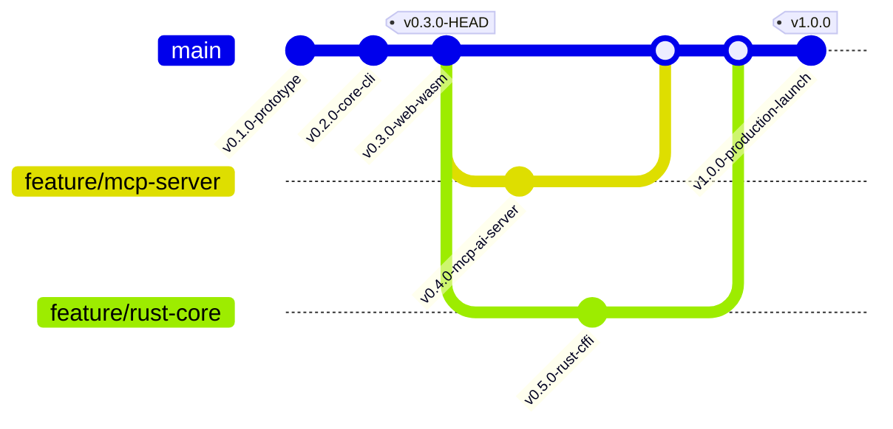

---
tags:
  - Roadmap
  - Product Vision
  - Milestones
---

# Product Roadmap & Architectural Progression

This document outlines the official 5-Phase architectural roadmap and release progression for **`brando.`** as defined in the system PRD.

---

## Git Branch Release Graph

---

## Git Branch Commit Log & Milestones

  <!-- Commit v0.1.0 -->
  

    

      

      

    

    

      

        [main 4f2a1b9] tag: v0.1.0
        COMPLETED
      

      <strong style="font-size: 1rem; display: block; margin-bottom: 0.25rem;">Phase 0: Prototype Baseline</strong>
      Experimental phonetic generators, flat file CSV parsing, and initial feasibility proof.
    

  

  <!-- Commit v0.2.0 -->
  

    

      

      

    

    

      

        [main 8c9d2e1] tag: v0.2.0
        COMPLETED
      

      <strong style="font-size: 1rem; display: block; margin-bottom: 0.25rem;">Phase 1: Package & Click CLI Core</strong>
      3-Layer Engine architecture, Python SDK (`import brando`), Click CLI suite (`init`, `build`, `filter`, `verify`), and 5 technical feature modules.
    

  

  <!-- Commit v0.3.0 (HEAD) -->
  

    

      

      

    

    

      

        [main HEAD -> v0.3.0] tag: v0.3.0
        CURRENT RELEASE
      

      <strong style="font-size: 1rem; display: block; margin-bottom: 0.25rem;">Phase 2: Web Portal & WASM Playground</strong>
      SPA glassmorphism documentation site, Pyodide in-browser WASM execution playground, and topic tag indexing hub.
    

  

  <!-- Branch feature/mcp-server -->
  

    

      

      

    

    

      

        [feature/mcp-server] target: v0.4.0
        PLANNED
      

      <strong style="font-size: 1rem; display: block; margin-bottom: 0.25rem;">Phase 3: Native 8-Tool MCP AI Server</strong>
      Model Context Protocol (MCP) server integration for Claude Desktop, Cursor, and Antigravity AI agents.
    

  

  <!-- Branch feature/rust-cffi -->
  

    

      

      

    

    

      

        [feature/rust-cffi] target: v0.5.0
        PLANNED
      

      <strong style="font-size: 1rem; display: block; margin-bottom: 0.25rem;">Phase 4: Rust CFFI Core Engine Acceleration</strong>
      PyO3 Rust CFFI bindings accelerating candidate generation throughput to > 500,000 candidates/sec.
    

  

  <!-- Release v1.0.0 -->
  

    

      

    

    

      

        [main] release: v1.0.0
        PRODUCTION LAUNCH
      

      <strong style="font-size: 1rem; display: block; margin-bottom: 0.25rem;">Phase 5: Public Production Release Tag</strong>
      Public v1.0.0 production launch tag on main branch with PyPI OIDC automated release pipelines.
    

  

