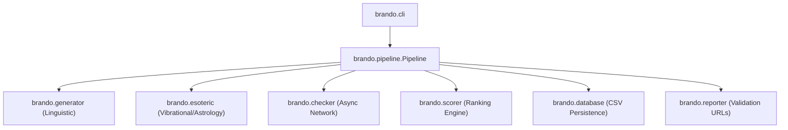

# Architecture & Design Document: Brando

This document defines the high-level system architecture, module boundaries, data pipelines, and internal API designs for the **Brando** brand naming framework. It serves as a blueprint to keep the codebase highly modular, clean, and extensible.

---

## Architectural Principles
To ensure long-term usability as both a CLI tool and a programmatic Python package, the design adheres to the following principles:

- **Separation of Concerns**: Core domain logic (scoring, checking, generating) contains no CLI or terminal code. It accepts standard Python data types (dicts, strings, lists) and returns them.

- **Zero-State Local Persistence**: The file system acts as the database via a structured CSV file (`brand_candidates.csv`). The core code reads, diffs, and writes to this file directly, making it stateless.

- **Concurrency by Default**: Web checks (DNS queries and HTTP handle checking) are fully asynchronous using Python's `asyncio` loop to allow checking hundreds of domains in seconds.

---

## Component Design & System Modules



### A. generator.py (Linguistic Engine)
This module parses prefix/suffix lists and combines them using custom linguistic rules:

- `estimate_syllables(word: str) -> int`: Simple vowel-group regex parser.

- `calculate_midline_ratio(word: str) -> float`: Evaluates letter casing. Flat midline letters: `a,c,e,i,m,n,o,r,s,u,v,w,x,z`.

- `check_visual_symmetry(word: str) -> bool`: Compares count of ascenders (`b,d,f,h,k,l,t`) against descenders (`g,j,p,q,y`).

- `generate_candidates(config: dict) -> list[str]`: Generates a list of candidates based on selected strategies (neoclassical, blends, metaphorical).

### B. esoteric.py (Vibrational & Astrology Engine)
Maps letters to numbers based on historical rules:

- `calculate_chaldean(word: str) -> tuple[int, int]`: Returns raw sum and single-digit reduction (1-9).

- `calculate_pythagorean(word: str) -> tuple[int, int]`: Returns raw sum and single-digit reduction (1-9).

- `check_vedic_astrology(word: str, preferred_sounds: list[str]) -> bool`: Checks if the starting letter or phoneme of the name matches any of the preferred auspicious sounds.

### C. checker.py (Network Availability Engine)
Uses asynchronous network checking:

- `async check_domain_dns(domain: str) -> str`: Checks DNS address info. Returns `available`, `taken`, or `error`.

- `async check_social_handle(platform: str, handle: str) -> str`: Performs async HTTP calls to profiles. Returns `available` if HTTP status is 404, otherwise `taken` or `error`.

- `async enrich_candidates_availability(names: list[str], domains: list[str], socials: list[str]) -> list[dict]`: Runs checks concurrently using `asyncio.gather`.

### D. database.py (File IO & Diffing Engine)
Handles file synchronization and config comparisons:

- `load_database(path: str) -> list[dict]`: Reads the existing CSV database.

- `save_database(path: str, data: list[dict]) -> None`: Writes raw data to the CSV.

- `get_generation_diff(config: dict, existing_names: list[str]) -> list[str]`: Compares generation rules in `config.yaml` against already generated names in the database, yielding only new candidates.

### E. scorer.py (Dynamic Scoring Engine)
Evaluates candidates based on the user's custom weighting configuration:

- `calculate_weighted_score(candidate: dict, config: dict) -> float`: Applies numeric scores and bonuses for astrology/numerology target matches.

- `rank_candidates(candidates: list[dict], config: dict) -> list[dict]`: Computes scores for all names and returns them sorted by score in descending order.

---

## Core Data Pipelines

### Pipeline 1: Incremental Generation & Enrichment (The "Build" Pipeline)
```text
[User runs 'brando build']
       │
       ▼
Read generation rules in config.yaml
       │
       ▼
Check brand_candidates.csv (Load existing names)
       │
       ▼
Perform Diff -> Identify NEW candidate names
       │
       ▼
For each NEW name:
 ├── Run esoteric calculations (Chaldean, Pythagorean)
 └── Run typographic balance calculations (Midline, Symmetry)
       │
       ▼
Run concurrent eager network checks (DNS only) for new names
       │
       ▼
Append new rows to brand_candidates.csv
```

### Pipeline 2: Scoring & Filtering (The "Filter" Pipeline)
```text
[User runs 'brando filter']
       │
       ▼
Load brand_candidates.csv & config.yaml
       │
       ▼
Filter out entries based on rules (e.g. allowed/disallowed chars, vowels/consonants count)
       │
       ▼
Apply weights & score bonuses (astrology, target numerology)
       │
       ▼
Rank candidates by final score
       │
       ▼
Output ranked list to stdout and write shortlist.csv
```

### Pipeline 3: Lazy Social Verification (The "Check-Socials" Pipeline)
```text
[User runs 'brando check-socials']
       │
       ▼
Load shortlist.csv (fallback to brand_candidates.csv)
       │
       ▼
Run concurrent lazy network checks (HTTP handles) only on shortlist
       │
       ▼
Display live progress bar & remaining ETA
       │
       ▼
Update CSV database with check results
```

---

## Verification & Testing Interfaces
Each module exposes direct function API hooks to allow clean unit tests without relying on database or CLI execution:

- Tests in `tests/test_esoteric.py` call `calculate_chaldean` and `calculate_pythagorean` directly with strings and assert expected values.

- Tests in `tests/test_generator.py` pass mocked configuration dictionaries and assert generated lengths and syllables.

- Tests in `tests/test_checker.py` mock DNS resolutions and HTTP network responses to verify status code checks.

---

## Development Operations & CI/CD Pipeline

- **Changelog Generation**: Conventional Commits are parsed using `scripts/generate_changelog.py` to auto-compile structured features, fixes, and docs updates directly into `CHANGELOG.md`.

- **Automation**: A GitHub Actions workflow `.github/workflows/deploy_docs.yml` and `.github/workflows/publish.yml` automatically manage docs deployment and OIDC PyPI publishing.
