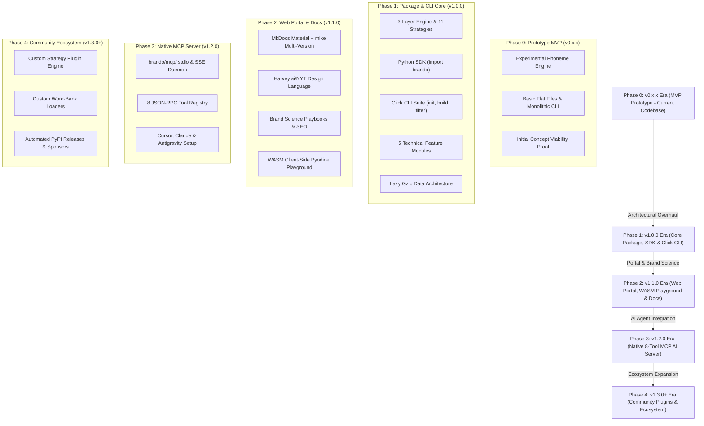

# **Enterprise Naming Intelligence Platform (Brando) - Project Requirements Document (v2.0)**

## **1. Executive Summary & Core Architectural Principles**

**Brando** is a data-driven naming intelligence engine that translates qualitative branding research into quantitative, filterable, and programmatically verifiable metrics. The platform evaluates proposed brand names across typographical visual structures, phonetic sound symbolism, cultural alignments, trademark registrations, digital domain spaces, and developer registry namespace constraints.

### **Product Objectives**
*   **Linguistic Scoring**: Replace subjective branding guesses with algorithmic metrics for readability, cadence, sound symbolism, and emotional resonance.
*   **Namespace Security & Verification**: Prevent security threats such as typosquatting and dependency confusion in open-source packages while confirming domain and social media handle availability.
*   **Legal & Regulatory Vetting**: Automate international Nice trademark classification checks, WIPO Madrid Protocol audits, and regional slang checks.
*   **AI-Agentic Orchestration**: Expose these tools via the Model Context Protocol (MCP) to integrate into developer environments, IDEs, and generative design agents.

### **Core Architectural Principles & Design Philosophy**

1.  **Maximally Permissive Generation**: Quality signals (pronounceability, sound symbolism, industry affinity, legal risks) migrate 100% to the **filter/analysis layer** as queryable database columns. The generator never deletes or suppresses candidate names on behalf of the user. Brand judgment belongs to the user, backed by data.
2.  **Zero-Config Unbiased Defaults**: Out-of-the-box generation is unbiased (`generation_alignment: []`, `phoneme_patterns: null`). User populates alignment targets only when specific founder, cultural, or industry biases exist.
3.  **100% Free & Local Security Engine**: Uses C++ SIMD `RapidFuzz` and `BK-Tree` metric indexing over bundled open-source brand datasets (`top_1000_*.txt`) to deliver sub-35ms phishing risk checks locally with $0.00 API cost.
4.  **Single Source of Truth Config**: All execution bounds, preset mappings, and filter parameters flow from a unified `config.yaml` schema contract.

---

## **2. Architectural Progression & Codebase Roadmap**

The product follows a clear **5-Phase Open-Source Architectural Progression** focused on delivering a production-grade Python library, developer CLI, Web Portal, and AI Agent MCP server:



### **Progression Milestones**:

#### **2A. Phase 0: MVP Prototype Core (Current Codebase State — `v0.x.x`)**
*   **Proof-of-Concept Baseline**: The initial prototype documented in legacy `docs/PRD.md`.
*   **Experimental Synthesis**: Tested basic phoneme combinations, initial sound symbolism scoring, and flat CSV file outputs (`brand_candidates.csv`).
*   **Validation Goal**: Validated core product viability and demonstrated market demand for computational naming logic.

#### **2B. Phase 1: Core Package, SDK & CLI Stabilization (`v1.0.0` Milestone)**
*   **Master PRD v2 Realignment**: The primary architectural focus of `prdv2.md`.
*   **Python SDK Library (`import brando`)**: Object-oriented API exposing `brando.Config`, `brando.Pipeline`, `brando.Database`, and Section 6 feature modules (`brando.modules.*`).
*   **Click CLI Command Suite**: Production terminal commands (`brando init`, `brando build`, `brando filter`, `brando verify`, `brando check-socials`, `brando export`, `brando prune`).
*   **3-Layer Engine & 11 Strategies**: Combines Layer 1 phoneme core synthesis with Layer 2 vocabulary enrichment and Layer 2a orthographic post-passes.
*   **5 Technical Feature Modules & Lazy Data**: Implements visual Bouma silhouettes (6A), sound symbolism (6B), esoteric numerology/Nakshatras (6C), Nice Class mapping (6D), and sub-35ms RapidFuzz SIMD security checks (6E) backed by lazy gzipped vocabulary assets (`.json.gz`).

#### **2C. Phase 2: Web Portal, Brand Science Playbooks & WASM Playground (`v1.1.0` Milestone)**
*   **Official Web Portal Deployment**: Publishes documentation site on GitHub Pages using MkDocs Material + `mike` multi-version engine.
*   **Harvey.ai / OpenAI / NYT Design System**: High-contrast Editorial Serif headers + obsidian dark glassmorphic UI.
*   **Brand Science Playbooks**: High-ranking SEO playbooks for Sound Symbolism, Bouma Silhouettes, 108 Nakshatra Padas, and Typosquatting protection.
*   **WASM Client-Side Playground**: Pyodide web demo allowing users to build `config.yaml` live in the browser without installing Python locally.

#### **2D. Phase 3: Native MCP AI Agent Integration (`v1.2.0` Milestone)**
*   **Native MCP Server (`brando/mcp/`)**: Implements Model Context Protocol (MCP) exposing an 8-tool JSON-RPC registry (3 High-Level Workflows + 5 Atomic Engine Tools) for AI LLM Agents (Cursor, Claude Desktop, Gemini Antigravity Agent).
*   **Agent Setup Templates**: Includes 1-click configuration blocks for Cursor `.cursor/mcp.json` and Claude Desktop `claude_desktop_config.json`.

#### **2E. Phase 4: Community Strategy Plugin Engine & Open-Source Ecosystem (`v1.3.0+` Lineage)**
*   **Custom Strategy Plugin Engine**: Extends `enrichment.custom_rules`, `custom_substitution_map`, and `custom_word_bank_path` to support user-authored naming plugins.
*   **Automated Release & Sponsorships**: Automated PyPI wheel publishing via OIDC and GitHub Sponsors wall (`SPONSORS.md`).

> [!NOTE]
> **Commercial SaaS Scope Isolation**: Any future commercial cloud hosting platform, multi-tenant SaaS service, or managed REST API operates under a **separate private repository scope**. This open-source repository remains 100% dedicated to open-source package, SDK, CLI, and MCP community excellence.

---

## **3. Master Configuration Schema Specification (`config.yaml`)**

The `config.yaml` file is the **upstream single source of truth** for all platform settings. Every execution parameter flows directly from this specification.

```yaml
# ═══════════════════════════════════════════════════════════════
# SECTION A: Naming Context, Registry & Industry  [COMMAND: brando build]
# ═══════════════════════════════════════════════════════════════
# STEP 1: Set naming_context — high-level intent / use case:
#   company     → brand name for a company or startup (no registry)
#   product     → consumer product or SaaS product name (no registry)
#   startup     → invented feel, domain-safe, strong initials (no registry)
#   software    → general software ecosystem name (pair with registry)
#   package     → package manager name (pair with registry)
#   module      → importable module / library (pair with registry)
#   repo        → source code repository name (pair with registry)
#   custom      → define raw constraints manually (no preset)
naming_context: company

# STEP 2: Set registry — specific ecosystem whose formatting rules apply.
# Only required when naming_context is: software | package | module | repo
registry: null   # e.g. npm | pypi | go | crates | nuget | maven | docker | ...

# STEP 3: Set industry_context — target commercial sector or hybrid list.
# null = Unbiased General Default (no industry assumption)
# Automatically maps default Nice Class codes, TLD clusters, and social channels when set:
#   tech         → Class 9 (Apps), 35 (Biz), 42 (SaaS) | TLDs: .ai, .io, .dev, .com
#   fashion      → Class 25 (Apparel), 35 (Retail) | TLDs: .shop, .store, .co, .com
#   food         → Class 29 (Dairy/Meats), 30 (Coffee/Snacks), 32 (Drinks), 35 (Store)
#   pharma       → Class 5 (Pharma/Supplements), 10 (Medical Devices), 44 (Health)
#   fintech      → Class 9 (Banking App), 36 (Financial), 42 (Fintech SaaS)
#   cosmetics    → Class 3 (Skincare/Perfumes/Cosmetics), 35 (Beauty Retail)
#   entertainment→ Class 9 (Gaming Apps), 41 (Media/Entertainment Services)
#   real_estate  → Class 36 (Real Estate Affairs), 37 (Construction/Development)
#   custom       → Define explicit nice_classes list manually in validation block
industry_context: null   # null = unbiased default | e.g. tech | fashion | food | fintech


# ═══════════════════════════════════════════════════════════════
# SECTION B: Core Generator — Phoneme Synthesis  [COMMAND: brando build]
# ═══════════════════════════════════════════════════════════════
generation:
  # Phoneme structural templates (core engine patterns)
  # null = Dynamic Generation Mode (synthesizes ALL valid 0-CC combinations up to max_segment_letters)
  # [CVC, CVCV, CVVC, CVCVC] = Explicit Custom Pattern List
  phoneme_patterns: null

  # Automatic 'q' -> 'qu' bigram transformation
  # true (default) = generates 'quavo', 'quera' (English convention)
  # false = allows raw 'q' floating in C slots ('qavo', 'qvla', 'qraft' for Gen-Z/gaming brands)
  auto_qu_bigram: true

  # Default consonant pool: ALL 21 consonants — generation is maximally permissive.
  phoneme_consonants: [b, c, d, f, g, h, j, k, l, m, n, p, q, r, s, t, v, w, x, y, z]

  # Default vowel pool: all 5 base vowels
  phoneme_vowels: [a, e, i, o, u]

  # Starting letter preferences (biases first character during generation)
  preferred_initials: []   # e.g. [A, V, X] — empty = use all letters equally

  # Multi-Segment Chaining (controls compound & long names)
  max_segments: 1             # 1 = single word, 2 = two-block, 3 = three-block
  max_segment_letters: 7      # max chars per individual phoneme block
  segment_separator: null     # null=fused (BookMyShow), "-"=hyphen, "_"=snake, "."=dot


# ═══════════════════════════════════════════════════════════════
# SECTION C: Raw Constraints Override  [COMMAND: brando build]
# ═══════════════════════════════════════════════════════════════
constraints:
  min_letters: null        # e.g. 4 (null = use naming_context default)
  max_letters: null        # e.g. 7 (null = use naming_context default)
  max_syllables: null      # e.g. 2 (null = use naming_context default)
  max_candidates: 10000    # total pool size cap
  allowed_chars: null      # e.g. "^[a-zA-Z]+$"
  disallowed_chars: []
  allow_numbers: null
  allow_hyphens: null
  allow_underscores: null
  min_vowels: null
  max_vowels: null
  min_consonants: null
  max_consonants: null


# ═══════════════════════════════════════════════════════════════
# SECTION D: Vocabulary Enrichment Strategies  [COMMAND: brando build]
# ═══════════════════════════════════════════════════════════════
# Layer 2 enrichment strategies add semantic flavor & word blends to the pool.
# DATA ARCHITECTURE: Brando bundles 100K+ roots & vocabulary datasets in
# brando/data/vocabularies/. If auto_industry_roots: true, Brando automatically
# loads industry-specific root banks. Users can append or override via custom fields.
enrichment:
  # Auto-load industry root dictionaries & strategy defaults based on industry_context
  auto_industry_roots: true    # true (default) | false (use manual lists below)

  # Enabled strategies list.
  # Available Layer 2 Enrichment Strategies:
  #   - neoclassical      → Latin/Greek root morphemes (Novartis, Altria, Sonos)
  #   - portmanteau       → Word blends with letter merge (Microsoft, Pinterest, FedEx)
  #   - analogous_suffix  → Brand suffix blending (Shopify, Spotify, Bitly, Solana)
  #   - metaphorical      → Real words out of context (Apple, Slack, Amazon)
  #   - compound          → Concatenated full words (Facebook, ThinkPad, WordPress)
  #   - truncation        → Clipped root seeds (Intel, FedEx, Dunkin')
  #   - acronym           → Phrase initialisms (IBM, GEICO, NASA)
  #   - suggestive        → Thesaurus concept proximity (Swiffer, Fitbit, Uber)
  strategies: []              # empty = auto-selected via industry_context (or set explicit list)

  # Enabled Layer 2a Post-Pass Orthographic Modifications:
  post_passes: []             # e.g. [phonetic_spell, letter_sub, alphanumeric] — empty = none

  # Detailed Post-Pass Transformation Settings & Custom Extension Surface
  post_pass_settings:
    phonetic_spell:
      drop_final_vowel: true   # Flickr (Flicker -> Flickr), Tumblr (Tumbler -> Tumblr)
      i_to_y: true             # Lyft (Lift -> Lyft), Vybe (Vibe -> Vybe)
      c_to_k: true             # Krispy (Crispy -> Krispy), Kwik (Quick -> Kwik)
      f_to_ph: false           # Phast (Fast -> Phast)
      z_for_s: false           # Boyz (Boys -> Boyz)
      custom_rules: []         # User custom regex/phonetic pairs, e.g. [{pattern: "tion$", replace: "shun"}]

    letter_sub:
      substitution_map:
        i: y                   # Zymbol (Symbol -> Zymbol)
        o: oo                  # Froot (Fruit -> Froot)
        s: z                   # Zappos (Zapatos -> Zappos)
        x: ks                  # Pixar (Picsar -> Pixar)
      custom_substitution_map: {} # User custom letter swap dictionary, e.g. { a: "8", e: "3" }

    alphanumeric:
      placement: suffix        # suffix | prefix | infix
      separator: "-"           # "-", "_", or null
      allowed_numerals: [21, 42, 360, 247, 7] # e.g. Nexus-21, Xbox-360, WD-40
      custom_numerals: []      # User custom serial numbers, e.g. [99, 500, 3000]
      auto_year: false         # true = appends current year (e.g. Brando-2026)

  # Custom Vocabulary Override & Extension Surface (Appends to or overrides bundled data)
  custom_prefixes: []          # e.g. [nova, apex, sys, flux, kinet]
  custom_suffixes: []          # e.g. [tech, link, sys, flux, vance]
  brand_suffixes: [ify, ly, io, ex, is, a]  # built-in modern brand suffixes
  custom_brand_suffixes: []   # user custom brand suffixes, e.g. [base, lab, box]
  word_bank_themes: []         # e.g. [tech, speed, nature, security]
  custom_word_bank_path: null  # path to line-separated custom dictionary file (.txt/.json)
  acronym_phrases: []          # e.g. ["Vertex Intelligence Systems"]


# ═══════════════════════════════════════════════════════════════
# SECTION E: Build-Time Generation Biases  [COMMAND: brando build]
# ═══════════════════════════════════════════════════════════════
# Initial letter & cultural biases applied DURING candidate creation.
# Default is EMPTY ([]) for 100% unbiased generation across all letters.
# Populate only if you have specific brand alignment targets:
#   - Founder Initials: preferred_initials: [S, B]
#   - Vedic Astrology: vedic_starting_sounds: [ra, ka, sha]
#   - Family Heritage: family_heritage: { preferred_initials: [S, B], legacy_roots: [vance, forge] }
generation_alignment:
  preferred_initials: []       # e.g. [A, B, V] — empty = use all letters equally
  vedic_starting_sounds: []   # e.g. [ra, ma, ka] — empty = no astrological bias
  family_heritage:
    preferred_initials: []     # e.g. [S, B] — founder/family starting initials
    legacy_roots: []           # e.g. [vance, forge] — historic family roots to blend


# ═══════════════════════════════════════════════════════════════
# SECTION F: Validation Rules  [COMMAND: brando check-socials | brando verify]
# ═══════════════════════════════════════════════════════════════
# External network verification target lists.
# UNBIASED DEFAULTS: Universal TLDs (.com, .co), universal socials, and Class 35 (General Business).
# Setting industry_context automatically expands these to sector TLDs (.ai, .shop) & channels.
validation:
  domains: [com, co]                 # Universal TLDs (com, co apply to all sectors)
  socials: [twitter, instagram, facebook] # Universal social networks
  nice_classes: [35]                 # Class 35 = Advertising & Business (universal to all brands)


# ═══════════════════════════════════════════════════════════════
# SECTION G: Filtration & Sound Symbolism Targets  [COMMAND: brando filter]
# ═══════════════════════════════════════════════════════════════
# Configures default filtering query parameters when running `brando filter`.
# Queries existing database columns in brand_candidates.csv without rebuilding.
filter:
  # Raw constraint query parameters (slices stored DB)
  min_letters: null              # e.g. 4
  max_letters: null              # e.g. 6
  max_syllables: null            # e.g. 2
  allowed_chars_regex: null      # e.g. "^[a-z]+$"
  min_vowels: null               # e.g. 2
  max_vowels: null               # e.g. 3

  # Sound symbolism archetypes & phoneme target filters
  sound_archetype: null          # Precise-Fast | Bold-Durable | Flow-Innovation | Warm-Luxurious
  consonant_flow: null           # Voiceless-Plosive | Voiced-Plosive | Fricative | Sonorant
  vowel_pitch: null              # Front | Back | Central
  rhythm_class: null             # Smooth | Staccato
  emphasis_weight: null          # Front-Weighted | End-Weighted
  min_euphony_score: null        # 0.0 - 10.0
  max_clusters: null             # Max allowed CC consonant clusters (e.g. 0)

  # Phoneme safety & cross-language flags
  international_safe_min: null   # 0 - 5
  soft_c_allowed: true           # set false to require hard-c only
  romance_language_safe: null    # true/false

  # Esoteric & Numerology filter targets
  pythagorean_targets: [1, 5, 9] # filter candidates matching root numbers
  chaldean_targets: [5, 6]       # filter candidates matching destiny roots
  zodiac_element: null           # Fire | Earth | Air | Water


# ═══════════════════════════════════════════════════════════════
# SECTION H: Optional Composite Scoring Lens  [COMMAND: brando filter]
# ═══════════════════════════════════════════════════════════════
# DESIGN PRINCIPLE: Composite scores dilute individual traceability.
# Individual metric scores (0-10) are ALWAYS stored as separate columns.
# Set composite_enabled: true ONLY if you want a single combined score computed.
#
# COMPOSITE SCORE PRIORITY WEIGHT RATIONALE:
# - Tier 1: Core Usability & Recall (Weight 4-5) → memorability, pronounce, visual
# - Tier 2: Commercial Risk & Scalability (Weight 3) → premium_feel, trademark, scalability
# - Tier 3: Specialized Niche Alignments (Weight 1-2) → international_safe, esoteric, heritage
scoring:
  composite_enabled: false   # set true to compute a weighted composite score (0-100)
  weights:
    memorability: 5          # Tier 1: Highest priority (brand recall & word-of-mouth)
    pronounce_score: 4       # Tier 1: High priority (phonetic fluency & ease of speech)
    visual_score: 4          # Tier 1: High priority (typographic logo balance & symmetry)
    premium_feel: 3          # Tier 2: Medium priority (perceived brand value & prestige)
    trademark_potential: 3   # Tier 2: Medium priority (WIPO / Nice registrability potential)
    scalability: 3           # Tier 2: Medium priority (category neutrality & domain ecosystem)
    international_safe: 2    # Tier 3: Low priority (cross-language safety checks)
    esoteric_score: 2        # Tier 3: Low priority (Pythagorean/Chaldean/Nakshatra alignment)
    heritage_score: 1        # Tier 3: Low priority (founder initial & legacy root match)
```
